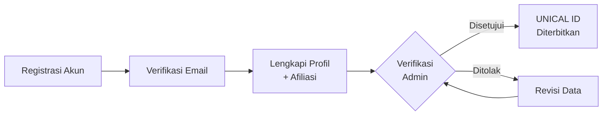
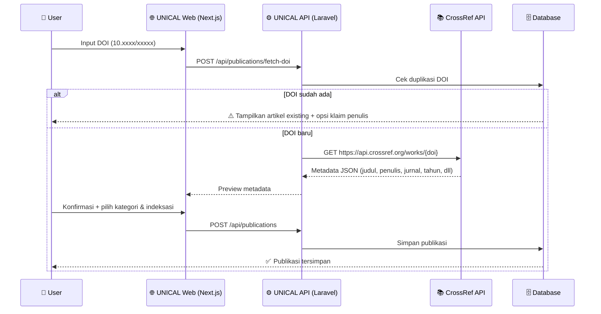
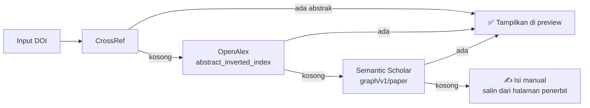
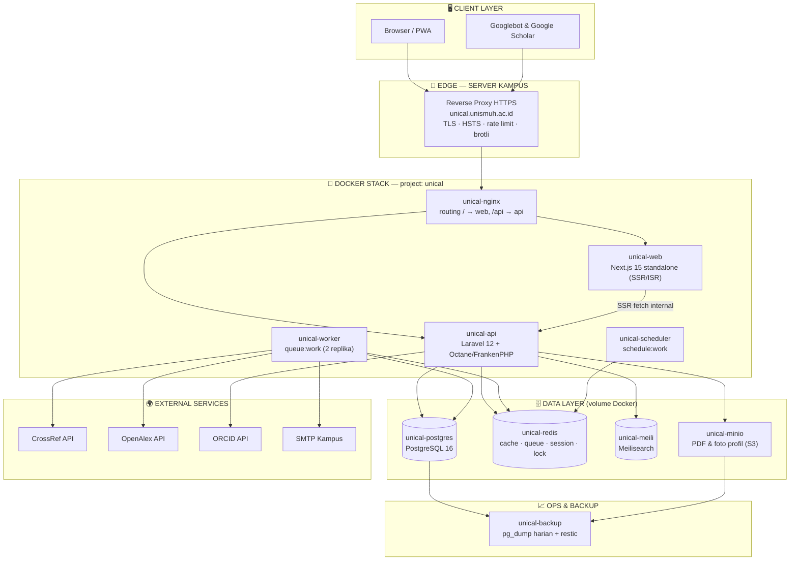
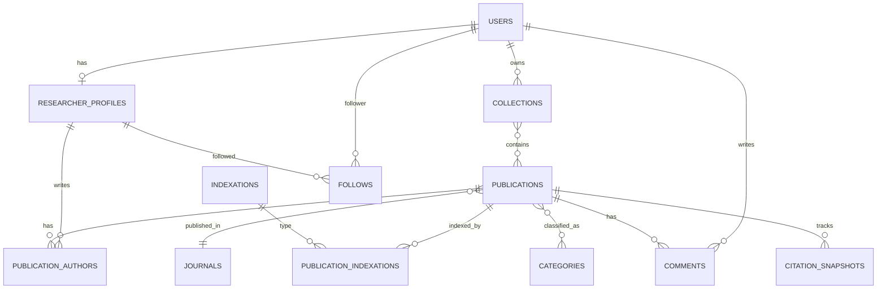
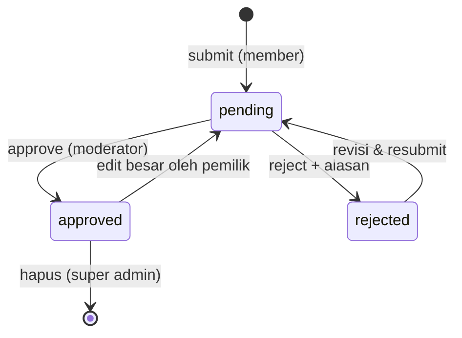

<div align="center">

# 🎓 UNICAL ASSOCIATES
### **Unismuh Ical Repository Associates**

*Platform Repositori Publikasi Ilmiah Terintegrasi — Discover, Connect, and Elevate Research*

[]()
[]()
[]()
[]()
[]()
[]()

</div>

---

## 📑 Daftar Isi

1. [Tentang UNICAL ASSOCIATES](#-1-tentang-unical-associates)
2. [Visi & Misi](#-2-visi--misi)
3. [Fitur Utama](#-3-fitur-utama)
4. [UNICAL ID — Sistem Identitas Peneliti](#-4-unical-id--sistem-identitas-peneliti)
5. [Sistem Upload Berbasis DOI](#-5-sistem-upload-berbasis-doi)
6. [Klasifikasi & Kategorisasi Jurnal](#-6-klasifikasi--kategorisasi-jurnal)
7. [Peran Pengguna (User Roles)](#-7-peran-pengguna-user-roles)
8. [Arsitektur Sistem](#-8-arsitektur-sistem)
9. [Teknologi (Tech Stack)](#-9-teknologi-tech-stack)
10. [Desain Database](#-10-desain-database)
11. [Desain API (Endpoint)](#-11-desain-api-endpoint)
12. [Struktur Folder Proyek](#-12-struktur-folder-proyek)
13. [Alur Kerja Pengguna (User Flow)](#-13-alur-kerja-pengguna-user-flow)
14. [Spesifikasi Halaman & Wireframe UI](#-14-spesifikasi-halaman--wireframe-ui)
15. [Metrik & Rumus Perhitungan](#-15-metrik--rumus-perhitungan)
16. [Background Jobs & Scheduler](#-16-background-jobs--scheduler)
17. [Sistem Notifikasi](#-17-sistem-notifikasi)
18. [SEO & Indeksasi Mesin Pencari](#-18-seo--indeksasi-mesin-pencari)
19. [Kebutuhan Non-Fungsional (NFR)](#-19-kebutuhan-non-fungsional-nfr)
20. [Roadmap Pengembangan](#-20-roadmap-pengembangan)
21. [Instalasi & Menjalankan Proyek](#-21-instalasi--menjalankan-proyek)
22. [Troubleshooting (Docker)](#-22-troubleshooting-docker)
23. [Strategi Pengujian (Testing)](#-23-strategi-pengujian-testing)
24. [Keamanan, Privasi & Kepatuhan](#-24-keamanan-privasi--kepatuhan)
25. [Konvensi Kode & Git Workflow](#-25-konvensi-kode--git-workflow)
26. [FAQ](#-26-faq)
27. [Glosarium](#-27-glosarium)
28. [Kontribusi](#-28-kontribusi)
29. [Lisensi](#-29-lisensi)
30. [Kontak & Tim](#-30-kontak--tim)

---

## 🌟 1. Tentang UNICAL ASSOCIATES

**UNICAL ASSOCIATES (Unismuh Ical Repository Associates)** adalah platform web repositori publikasi ilmiah yang terinspirasi dari **ScienceDirect** dan **ResearchGate**. UNICAL dirancang sebagai pusat agregasi seluruh jurnal/artikel yang telah dipublikasikan oleh sivitas akademika, dengan sistem identitas peneliti unik (**UNICAL ID**) yang berfungsi seperti **Scopus Author ID**.

Keunggulan utama UNICAL adalah **upload berbasis DOI** — pengguna cukup memasukkan DOI artikel, dan sistem akan otomatis mengambil seluruh metadata (judul, penulis, abstrak, jurnal, tahun, volume, halaman, sitasi) — persis seperti cara kerja **Mendeley**.

Seluruh layanan (frontend, backend, worker, database, cache, search, storage) berjalan sebagai **satu stack Docker mandiri di server kampus**, diakses publik melalui subdomain resmi ber-TLS.

### Mengapa UNICAL ASSOCIATES?

| Masalah | Solusi UNICAL |
|---|---|
| Publikasi dosen/peneliti tersebar di banyak platform | Satu repositori terpusat untuk semua publikasi |
| Input metadata manual rawan salah & melelahkan | Auto-fetch metadata via DOI (CrossRef API) |
| Sulit melacak rekam jejak peneliti | UNICAL ID unik per peneliti + halaman profil publik |
| Sulit memfilter jurnal berdasarkan bidang & indeksasi | Klasifikasi multi-level: bidang ilmu, Scopus (Q1–Q4), SINTA (1–6) |
| Tidak ada statistik kinerja riset institusi | Dashboard analitik: jumlah publikasi, sitasi, h-index |

---

## 🎯 2. Visi & Misi

### Visi
> Menjadi platform repositori riset terdepan yang menghubungkan peneliti, mempermudah akses publikasi ilmiah, dan meningkatkan visibilitas riset institusi di tingkat nasional maupun internasional.

### Misi
1. 📚 Menyediakan repositori terpusat untuk seluruh publikasi ilmiah yang telah terbit.
2. 🆔 Memberikan identitas digital unik (UNICAL ID) bagi setiap peneliti.
3. ⚡ Menyederhanakan proses dokumentasi publikasi melalui integrasi DOI otomatis.
4. 🔍 Memudahkan penemuan riset melalui pencarian dan klasifikasi yang kaya.
5. 📊 Menyediakan metrik dan analitik riset untuk peneliti dan institusi.
6. 🤝 Membangun jejaring kolaborasi antar peneliti.

---

## 🚀 3. Fitur Utama

### 3.1 Fitur Inti (Core Features)

#### 🆔 UNICAL ID
- ID unik untuk setiap peneliti (mirip Scopus Author ID / ORCID).
- Format: `UNICAL-XXXXXXXX` (8 digit unik).
- Semua publikasi terikat ke UNICAL ID penulis.
- Dapat ditautkan dengan ID eksternal: **ORCID, Scopus ID, SINTA ID, Google Scholar ID, Garuda ID**.

#### 📤 Upload Publikasi via DOI (Mendeley-style)
- Cukup masukkan **DOI** (contoh: `10.1016/j.eswa.2024.123456`).
- Sistem otomatis mengambil metadata lengkap dari **CrossRef / DataCite API**:
  - Judul, daftar penulis, afiliasi
  - Nama jurnal, penerbit, ISSN
  - Volume, issue, halaman, tahun terbit
  - Abstrak & kata kunci
  - Jumlah sitasi
- Dukungan **bulk import** (upload banyak DOI sekaligus via file `.csv` / `.txt` / `.bib`).
- Fallback input manual jika DOI tidak ditemukan.
- Deteksi duplikasi otomatis (satu DOI hanya tercatat sekali).

#### 🗂️ Klasifikasi Multi-Dimensi
- **Berdasarkan Bidang Ilmu**: Teknik, Pendidikan, Kesehatan, Ekonomi, Hukum, Agama, Pertanian, dll.
- **Berdasarkan Sub-Bidang**: Machine Learning, AI, IoT, Sipil, Elektro, PGSD, Matematika, dll.
- **Berdasarkan Indeksasi**:
  - 🌍 Scopus (Q1, Q2, Q3, Q4)
  - 🇮🇩 SINTA (S1, S2, S3, S4, S5, S6)
  - 📖 Web of Science (SCI, SSCI, ESCI)
  - 🔎 DOAJ, Garuda, Google Scholar, Copernicus
- **Berdasarkan Jenis Publikasi**: Artikel Jurnal, Prosiding Konferensi, Book Chapter, Buku, Preprint.

#### 🔍 Pencarian & Penemuan (ScienceDirect-style)
- Pencarian full-text: judul, abstrak, penulis, kata kunci, DOI, nama jurnal.
- **Advanced Search** dengan operator boolean (AND, OR, NOT).
- Filter multi-faset: tahun, bidang, indeksasi, kuartil, jenis publikasi, penulis.
- Sortir: terbaru, paling banyak disitasi, paling banyak dilihat, relevansi.
- Auto-complete / saran pencarian.

#### 👤 Profil Peneliti (ResearchGate-style)
- Halaman profil publik: `unical.unismuh.ac.id/profile/UNICAL-XXXXXXXX`
- Foto, biografi, afiliasi (fakultas/prodi), bidang keahlian.
- Daftar seluruh publikasi otomatis dari UNICAL ID.
- Metrik personal: total publikasi, total sitasi, **h-index**, i10-index.
- Grafik tren publikasi & sitasi per tahun.
- Tautan ke profil eksternal (ORCID, Scopus, SINTA, Scholar).

### 3.2 Fitur Pendukung

| Fitur | Deskripsi |
|---|---|
| 📊 **Dashboard Analitik** | Statistik institusi: publikasi/tahun, distribusi kuartil, top authors, top journals |
| 🔔 **Notifikasi** | Pemberitahuan saat publikasi disetujui, disitasi, atau diikuti peneliti lain |
| 👥 **Follow Peneliti** | Ikuti peneliti lain dan dapatkan update publikasi terbarunya |
| 💬 **Komentar & Diskusi** | Diskusi ilmiah di halaman setiap publikasi |
| 📎 **Ekspor Sitasi** | Ekspor ke format BibTeX, RIS, EndNote, APA, IEEE, MLA, Chicago |
| 📈 **Trending Research** | Publikasi terpopuler mingguan/bulanan |
| 🏷️ **Koleksi/Reading List** | Simpan publikasi ke koleksi pribadi (seperti library Mendeley) |
| 🌐 **Multi-bahasa** | Antarmuka Bahasa Indonesia & Inggris |
| 📱 **Responsive Design** | Optimal di desktop, tablet, dan mobile |
| ✅ **Verifikasi Admin** | Publikasi diverifikasi admin sebelum tampil publik (opsional per kebijakan) |
| 🔗 **API Publik** | REST API untuk integrasi dengan sistem lain (SIMLITABMAS, SISTER, dll.) |
| 📄 **Full-text PDF** (opsional) | Upload PDF open-access sesuai kebijakan hak cipta penerbit |

---

## 🆔 4. UNICAL ID — Sistem Identitas Peneliti

### 4.1 Konsep

Setiap pengguna yang terdaftar dan terverifikasi mendapatkan **UNICAL ID** — identitas digital permanen yang tidak berubah meski afiliasi berubah, sama seperti Scopus Author ID.

```
Format : UNICAL-XXXXXXXX
Contoh : UNICAL-24000157
         │      │└──────┴─ 6 digit nomor urut unik
         │      └────────── 2 digit tahun registrasi
         └───────────────── prefix platform
```

### 4.2 Fungsi UNICAL ID

1. **Disambiguasi penulis** — membedakan peneliti dengan nama sama.
2. **Agregasi publikasi** — semua publikasi otomatis terkumpul di satu profil.
3. **Klaim publikasi** — penulis dapat mengklaim artikel yang memuat namanya.
4. **Metrik akurat** — h-index & sitasi dihitung per ID, bukan per nama.
5. **Interoperabilitas** — dapat dipetakan ke ORCID / Scopus ID / SINTA ID.

### 4.3 Proses Penerbitan ID



### 4.4 Algoritma Pembuatan UNICAL ID

```php
// app/Services/UnicalIdService.php (pseudocode)
public function generate(): string
{
    $year = now()->format('y');                       // "26" untuk 2026
    // Ambil nomor urut terakhir tahun ini dengan LOCK (hindari race condition)
    $last = DB::table('researcher_profiles')
        ->where('unical_id', 'like', "UNICAL-{$year}%")
        ->lockForUpdate()
        ->max('unical_id');
    $seq  = $last ? ((int) substr($last, 9)) + 1 : 1; // increment
    return sprintf('UNICAL-%s%06d', $year, $seq);     // UNICAL-26000001
}
```

**Aturan teknis:**
1. ⚡ Dibuat dalam **DB transaction + row lock** — dijamin tidak duplikat meski registrasi bersamaan.
2. 🔒 **Immutable** — sekali diterbitkan tidak pernah berubah/dihapus, meskipun akun dinonaktifkan (soft delete).
3. 🚫 ID akun yang dihapus **tidak didaur ulang**.
4. ✅ Validasi format: regex `^UNICAL-\d{8}$`.
5. 🔍 URL profil publik permanen: `/profile/UNICAL-26000001`.

### 4.5 Alur Klaim Kepenulisan (Author Claiming)

Kasus: artikel di-upload orang lain (mis. admin/co-author), nama Anda ada di daftar penulis tetapi belum tertaut ke akun Anda.

```mermaid
flowchart TD
    A[🔍 Peneliti menemukan artikelnya\ndi halaman publikasi] --> B[Klik tombol \"Ini publikasi saya\"]
    B --> C[Pilih nama penulis yang sesuai\ndari daftar author artikel]
    C --> D[Sistem membuat claim_request\nstatus: pending]
    D --> E{Moderator memeriksa\nkecocokan nama & afiliasi}
    E -- Cocok --> F[✅ publication_authors.researcher_id\ndiisi → artikel muncul di profil\n→ metrik dihitung ulang]
    E -- Tidak cocok --> G[❌ Ditolak + alasan\n→ notifikasi ke pemohon]
```

**Anti-penyalahgunaan:** satu slot penulis hanya bisa diklaim satu akun; klaim yang ditolak 3× memblokir klaim ulang pada artikel yang sama; moderator melihat riwayat klaim pemohon.

### 4.6 Kebijakan Identitas

| Kebijakan | Ketentuan |
|---|---|
| Satu orang satu ID | Duplikat akun digabung oleh admin (merge profile), ID tertua dipertahankan |
| Perubahan nama | Diizinkan (menikah, gelar); riwayat nama disimpan untuk pencarian |
| Pindah afiliasi | Afiliasi bisa diubah; ID tetap; riwayat afiliasi tercatat |
| Akun eksternal | Penulis non-Unismuh tampil sebagai teks nama (raw_author_name) tanpa ID, bisa diklaim jika kelak mendaftar |

---

## 📥 5. Sistem Upload Berbasis DOI

### 5.1 Alur Kerja (seperti Mendeley)



### 5.2 Sumber Metadata

| Prioritas | Sumber | Kegunaan |
|---|---|---|
| 1 | **CrossRef REST API** | Metadata utama artikel jurnal (gratis, tanpa API key) |
| 2 | **DataCite API** | DOI dataset & repositori |
| 3 | **OpenAlex API** | Pelengkap: abstrak, topik, sitasi, afiliasi |
| 4 | **Semantic Scholar API** | Cadangan abstrak paling ampuh + referensi & sitasi |
| 5 | **Input Manual** | Fallback jika DOI tidak terindeks di mana pun |

### 5.3 Metadata Otomatis — Beserta Tingkat Keandalannya

> 🧪 **Diverifikasi langsung** ke API CrossRef, OpenAlex, dan Semantic Scholar pada 19 Agustus 2026 memakai tiga DOI nyata dari penerbit berbeda.

| Field | Keandalan | Catatan |
|---|---|---|
| Judul | 🟢 hampir selalu ada | CrossRef |
| Daftar penulis + urutan | 🟢 hampir selalu ada | CrossRef |
| Jurnal, penerbit, ISSN | 🟢 | CrossRef |
| Volume, issue, halaman | 🟢 | CrossRef |
| Tanggal terbit | 🟢 | CrossRef |
| Jumlah sitasi | 🟢 | `is-referenced-by-count` |
| URL resmi & lisensi | 🟢 | CrossRef |
| **Abstrak** | 🟡 **tidak selalu ada** | Elsevier & Springer Nature umumnya tidak menyetor abstrak ke CrossRef → wajib pakai rantai fallback |
| **Afiliasi penulis** | 🟡 tergantung penerbit | MDPI lengkap; Elsevier & Nature kosong pada uji |
| **Kata kunci** | 🔴 hampir selalu kosong | Field `subject` CrossRef praktis tidak diisi → ambil dari topik OpenAlex |

**Hasil uji nyata:**

| DOI (penerbit) | Judul | Abstrak di CrossRef | Afiliasi | Kata kunci | Sitasi |
|---|:-:|:-:|:-:|:-:|--:|
| `10.1038/nature12373` (Nature) | ✅ | ❌ | 0 dari 8 | 0 | 1.805 |
| `10.1016/j.eswa.2019.112948` (Elsevier) | ✅ | ❌ | 0 dari 3 | 0 | 934 |
| `10.3390/su13084314` (MDPI) | ✅ | ✅ | 3 dari 3 | 0 | 13 |

#### 5.3.1 Rantai Fallback Abstrak (wajib diterapkan)



Bukti rantai ini bekerja: abstrak `10.1038/nature12373` **tidak ada** di CrossRef maupun OpenAlex, tetapi **tersedia di Semantic Scholar sepanjang 1.493 karakter**.

> ⚠️ Semantic Scholar menerapkan rate limit ketat — satu percobaan pada uji dibalas *connection reset*. Karena itu panggilannya harus lewat **queue dengan retry dan jeda**, bukan saat pengguna menunggu di layar preview.

> 💡 Jadi ya, alurnya persis seperti **Mendeley**: tempel DOI → metadata terisi sendiri. Sama seperti Mendeley pula, kolom abstrak kadang kosong untuk artikel Elsevier/Nature — itulah sebabnya UNICAL menambah dua sumber cadangan dan menyediakan kolom isian manual.

### 5.4 Bulk Import

```
Format yang didukung:
├── daftar-doi.txt   → satu DOI per baris
├── daftar-doi.csv   → kolom "doi" (+ kolom kategori opsional)
└── library.bib      → ekspor dari Mendeley/Zotero (BibTeX)
```

**Alur bulk import:** file di-parse → setiap DOI dimasukkan ke **Laravel Queue** sebagai job terpisah → diproses berurutan (rate-limit aman ke CrossRef) → progress ditampilkan real-time di dashboard (`5/40 selesai, 2 gagal`) → laporan akhir bisa diunduh (DOI sukses / duplikat / gagal + alasan).

### 5.5 Validasi & Normalisasi Input DOI

Semua bentuk input berikut diterima dan dinormalisasi ke format kanonik `10.xxxx/xxxxx`:

| Input Pengguna | Hasil Normalisasi |
|---|---|
| `10.1016/j.eswa.2024.123456` | ✅ sudah kanonik |
| `https://doi.org/10.1016/j.eswa.2024.123456` | strip prefix URL |
| `http://dx.doi.org/10.1016/...` | strip prefix URL lama |
| `doi:10.1016/...` | strip skema `doi:` |
| `  10.1016/... ` (spasi/newline) | trim whitespace |
| `10.1016/ABC` vs `10.1016/abc` | lowercase (DOI case-insensitive) |

```php
// Validasi format (regex resmi CrossRef)
preg_match('/^10.\d{4,9}\/[-._;()\/:A-Z0-9]+$/i', $doi);
```

### 5.6 Pemetaan Field CrossRef → Database

| Field CrossRef (JSON) | Kolom DB | Catatan |
|---|---|---|
| `message.title[0]` | `publications.title` | |
| `message.abstract` | `publications.abstract` | strip tag JATS `<jats:p>`; **sering kosong** → lanjut ke OpenAlex, lalu Semantic Scholar (§5.3.1) |
| `message.author[]` (given, family, sequence, affiliation) | `publication_authors.raw_author_name` + `author_order` | dicocokkan fuzzy ke researcher_profiles |
| `message.container-title[0]` | `journals.name` | find-or-create jurnal |
| `message.publisher` | `journals.publisher` | |
| `message.ISSN[]` | `journals.issn / eissn` | |
| `message.volume` / `issue` / `page` | `publications.volume/issue/pages` | |
| `message.published.date-parts` | `publications.published_date` | fallback: published-print → published-online → created |
| `message.subject[]` | `publications.keywords` | JSON array; pada praktiknya hampir selalu kosong → pakai `topics` dari OpenAlex |
| `message.URL` | `publications.url` | |
| `message.type` | `publications.type` | mapping: `journal-article`→journal_article, `proceedings-article`→proceeding, dst. |
| `message.is-referenced-by-count` | `publications.citation_count` | diperbarui berkala |
| `message.license[]` | deteksi open access | |
| *(respon utuh)* | `publications.metadata_raw` | JSON, untuk audit & re-parse |

### 5.7 Penanganan Error Fetch DOI

| Kondisi | HTTP dari CrossRef | Respon UNICAL ke user | Aksi sistem |
|---|---|---|---|
| DOI tidak ditemukan | `404` | "DOI tidak terdaftar di CrossRef. Coba DataCite / input manual." | fallback otomatis ke DataCite |
| Format DOI salah | — (gagal regex) | "Format DOI tidak valid. Contoh benar: 10.1016/j.eswa.2024.123456" | tidak ada request keluar |
| DOI sudah ada di UNICAL | — | "Artikel sudah terdaftar" + link + tombol **Klaim sebagai penulis** | tidak duplikat |
| CrossRef timeout / down | `5xx` / timeout | "Server metadata sibuk, dicoba ulang otomatis." | retry 3× exponential backoff via queue |
| Rate limit | `429` | idem | delay + retry; gunakan polite pool (`mailto`) |
| Metadata tidak lengkap (tanpa abstrak dll.) | `200` | Preview tampil, field kosong bisa diisi manual | jalankan rantai fallback §5.3.1, simpan `metadata_raw` |

### 5.8 Caching Metadata

- Respon CrossRef di-cache (key = DOI) selama **24 jam** → fetch ulang DOI sama tidak memukul API.
- Jumlah sitasi diperbarui terjadwal (lihat [§16 Background Jobs](#-16-background-jobs--scheduler)), bukan real-time.

---

## 🗂️ 6. Klasifikasi & Kategorisasi Jurnal

### 6.1 Hierarki Kategori Bidang Ilmu

```
📁 Teknik & Teknologi
│   ├── Teknik Informatika
│   │   ├── Machine Learning & AI
│   │   ├── Data Science
│   │   ├── Computer Vision
│   │   ├── NLP
│   │   ├── IoT & Embedded Systems
│   │   └── Cyber Security
│   ├── Teknik Elektro
│   ├── Teknik Sipil
│   ├── Teknik Mesin
│   └── Arsitektur
📁 Pendidikan
│   ├── Pendidikan Matematika
│   ├── Pendidikan Bahasa
│   ├── PGSD
│   ├── Teknologi Pendidikan
│   └── Manajemen Pendidikan
📁 Kesehatan & Kedokteran
📁 Ekonomi & Bisnis
📁 Hukum
📁 Agama Islam
📁 Pertanian
📁 Sosial & Politik
📁 MIPA
└── ... (dapat ditambah oleh admin)
```

### 6.2 Klasifikasi Indeksasi

| Indeks | Level | Badge Warna |
|---|---|---|
| **Scopus** | Q1 / Q2 / Q3 / Q4 / Non-Q | 🟥 Q1 · 🟧 Q2 · 🟨 Q3 · 🟩 Q4 |
| **SINTA** | S1 / S2 / S3 / S4 / S5 / S6 | 🔵 Gradasi biru |
| **Web of Science** | SCIE / SSCI / AHCI / ESCI | 🟪 Ungu |
| **DOAJ** | Terindeks / Tidak | 🟢 Hijau |
| **Garuda** | Terindeks / Tidak | ⚪ Abu-abu |

> 💡 Satu publikasi bisa punya **beberapa badge sekaligus** (misal: Scopus Q2 + SINTA 1 + DOAJ).

### 6.3 Contoh Tampilan Filter (Sidebar ScienceDirect-style)

```
🔽 FILTER HASIL PENCARIAN
├── 📅 Tahun Publikasi        [2020 ─────●───● 2026]
├── 🌍 Indeksasi
│   ☑ Scopus Q1 (142)
│   ☐ Scopus Q2 (289)
│   ☑ SINTA 1 (97)
│   ☐ SINTA 2 (215)
├── 📁 Bidang Ilmu
│   ☑ Machine Learning (86)
│   ☐ Pendidikan Matematika (54)
├── 📄 Jenis Publikasi
│   ☑ Artikel Jurnal (1.204)
│   ☐ Prosiding (388)
└── 👤 Penulis
    ☐ [cari penulis...]
```

---

## 👥 7. Peran Pengguna (User Roles)

| Role | Hak Akses |
|---|---|
| 🌐 **Guest** | Mencari & membaca metadata publikasi, melihat profil publik |
| 👤 **Member (Peneliti)** | Semua akses Guest + upload DOI, klaim publikasi, profil UNICAL ID, koleksi pribadi, follow, komentar |
| ✅ **Verifikator/Moderator** | Semua akses Member + verifikasi publikasi baru, moderasi komentar |
| 🏛️ **Admin Fakultas** | Kelola data & statistik lingkup fakultas, verifikasi anggota fakultas |
| 👑 **Super Admin** | Kelola seluruh sistem: user, kategori, indeksasi, pengaturan, laporan institusi |

### 7.1 Matriks Izin Lengkap (Permission Matrix)

| Aksi | Guest | Member | Moderator | Admin Fakultas | Super Admin |
|---|:-:|:-:|:-:|:-:|:-:|
| Cari & baca publikasi | ✅ | ✅ | ✅ | ✅ | ✅ |
| Lihat profil peneliti | ✅ | ✅ | ✅ | ✅ | ✅ |
| Ekspor sitasi (BibTeX/RIS/APA) | ✅ | ✅ | ✅ | ✅ | ✅ |
| Registrasi & punya UNICAL ID | — | ✅ | ✅ | ✅ | ✅ |
| Upload publikasi via DOI | ❌ | ✅ | ✅ | ✅ | ✅ |
| Bulk import DOI | ❌ | ✅ | ✅ | ✅ | ✅ |
| Edit publikasi | ❌ | 🔶 milik sendiri* | ✅ | 🔶 fakultasnya | ✅ |
| Hapus publikasi | ❌ | ❌ | ❌ | ❌ | ✅ |
| Klaim kepenulisan | ❌ | ✅ | ✅ | ✅ | ✅ |
| Approve/reject publikasi | ❌ | ❌ | ✅ | 🔶 fakultasnya | ✅ |
| Approve/reject klaim penulis | ❌ | ❌ | ✅ | 🔶 fakultasnya | ✅ |
| Moderasi komentar | ❌ | 🔶 hapus milik sendiri | ✅ | 🔶 fakultasnya | ✅ |
| Verifikasi user baru (terbitkan ID) | ❌ | ❌ | ❌ | 🔶 fakultasnya | ✅ |
| Kelola kategori & indeksasi | ❌ | ❌ | ❌ | ❌ | ✅ |
| Kelola role user | ❌ | ❌ | ❌ | ❌ | ✅ |
| Lihat statistik institusi | ✅ publik | ✅ | ✅ | ✅ + fakultas | ✅ semua |
| Ekspor laporan (PDF/Excel) | ❌ | 🔶 milik sendiri | ❌ | 🔶 fakultasnya | ✅ |
| Akses audit log | ❌ | ❌ | ❌ | ❌ | ✅ |

> 🔶 = akses terbatas pada lingkup tertentu. \*Edit publikasi milik sendiri hanya saat status masih `pending`; setelah `approved`, perubahan mengajukan revisi ke moderator.

### 7.2 Implementasi di Laravel

- Kolom `users.role` (ENUM) + middleware `role:super_admin,faculty_admin`.
- **Laravel Policies** per model (`PublicationPolicy`, `ProfilePolicy`) untuk aturan kepemilikan (`update: user->id === publication->submitted_by && status === 'pending'`).
- Route admin dikelompokkan dengan prefix `/admin` + middleware `auth:sanctum` + `role:...`.

---

## 🏗️ 8. Arsitektur Sistem

> **Model deployment:** seluruh komponen (frontend, backend, worker, database, cache, search, storage) berjalan sebagai **satu stack Docker Compose di server kampus**. Akses publik hanya melalui **reverse proxy HTTPS** pada subdomain resmi kampus. Tidak memakai Vercel, tidak memakai ngrok.



### 8.1 Peta Container

| Container | Image / Basis | Peran | Port host |
|---|---|---|---|
| `unical-nginx` | nginx:1.27-alpine | Pintu masuk stack, routing `/` → web dan `/api` → api, cache aset statis | `127.0.0.1:48080` |
| `unical-web` | node:22-alpine (multi-stage, `output: standalone`) | Next.js SSR/ISR untuk SEO & Google Scholar | internal |
| `unical-api` | php:8.3 + FrankenPHP/Octane | REST API Laravel + Sanctum | internal |
| `unical-worker` | image sama dengan api | `queue:work` untuk DOI, sitasi, email (2 replika) | internal |
| `unical-scheduler` | image sama dengan api | `schedule:work` di dalam container | internal |
| `unical-postgres` | postgres:16-alpine | Database utama | `127.0.0.1:48432` |
| `unical-redis` | redis:7-alpine | Cache, queue, session, atomic lock | `127.0.0.1:48379` |
| `unical-meili` | getmeili/meilisearch:v1.10 | Pencarian & autocomplete | `127.0.0.1:48700` |
| `unical-minio` | minio/minio | Object storage PDF & foto profil (S3) | `127.0.0.1:48900` & `48901` |
| `unical-backup` | postgres:16-alpine + restic | `pg_dump` harian + retensi | — |

> Semua port di-bind ke `127.0.0.1` saja — satu-satunya pintu publik adalah reverse proxy kampus menuju `unical-nginx`. Rentang **`48000–48999` direservasi khusus untuk UNICAL** karena blok `45xxx–47xxx` sudah dipakai stack lain di server yang sama.

### 8.2 Prinsip Arsitektur

| Prinsip | Penerapan |
|---|---|
| 🔒 Isolasi | `name: unical` + network `unical-net`; seluruh container, volume, dan port berprefiks `unical` |
| 🧱 Stateless app | `unical-web`, `unical-api`, `unical-worker` tanpa state lokal → aman di-restart & di-scale |
| 💾 State terpusat | Hanya Postgres, Redis, Meilisearch, dan MinIO yang memiliki volume |
| ⚡ Same-origin | Frontend & API satu domain (`/api`) → tanpa CORS lintas domain dan tanpa preflight |
| 🩺 Healthcheck | Semua service punya healthcheck + `depends_on: condition: service_healthy` |
| ♻️ Rilis aman | Migrasi dijalankan sebagai job terpisah sebelum container app di-swap |
| 📉 Batas sumber daya | `deploy.resources.limits` per container agar tidak mengganggu layanan kampus lain |

### 8.3 Kepemilikan Sumber Daya — Berdiri Sendiri

> 🔒 **Aturan pokok:** UNICAL ASSOCIATES **tidak menumpang** layanan milik aplikasi lain di server kampus. Setiap dependensi dijalankan sebagai instance sendiri di dalam stack `unical`.

| Sumber daya | Milik UNICAL | ❌ Tidak boleh dipakai |
|---|---|---|
| Database | `unical-postgres` (instance sendiri, port `48432`) | Postgres bersama di `5432`/`5433`/`5434` |
| Cache & queue | `unical-redis` (instance sendiri, port `48379`) | Redis bersama di `6379`/`6380`/`6381` |
| Pencarian | `unical-meili` (instance sendiri, port `48700`) | Meilisearch/Elasticsearch aplikasi lain |
| Object storage | `unical-minio` + bucket `unical-assets` (port `48900`) | MinIO milik stack lain (`47900`, `9000`) |
| Web server | `unical-nginx` (port `48080`) | Nginx milik proyek lain |
| Network | `unical-net`, subnet khusus `10.48.0.0/16` | Bridge default atau network proyek lain (172.17–172.30 sudah terpakai) |
| Volume | `unical-pgdata`, `unical-redisdata`, `unical-meilidata`, `unical-miniodata` | Volume bersama |
| Direktori kode | `/opt/unical` | Direktori aplikasi lain |
| Backup | `~/unical-backups/` | Folder backup proyek lain |
| Kredensial | User DB `unical`, key MinIO & Meilisearch sendiri | Kredensial yang dipakai bersama |

**Kuota sumber daya khusus UNICAL** (server: 64 vCPU · 251 GiB RAM). Limit menjaga UNICAL tidak menggerus layanan lain, sedangkan reservation menjamin UNICAL tetap kebagian saat server sibuk:

| Container | CPU limit | RAM limit | Reservation |
|---|---|---|---|
| `unical-nginx` | 1.0 | 256M | 0.25 / 128M |
| `unical-web` | 4.0 | 2G | 1.0 / 512M |
| `unical-api` | 6.0 | 4G | 2.0 / 1G |
| `unical-worker` (×2) | 2.0 tiap replika | 1.5G tiap replika | 0.5 / 512M |
| `unical-scheduler` | 1.0 | 512M | 0.25 / 256M |
| `unical-postgres` | 8.0 | 16G | 2.0 / 4G |
| `unical-redis` | 2.0 | 4G (`maxmemory 3gb`) | 0.5 / 512M |
| `unical-meili` | 4.0 | 8G | 1.0 / 1G |
| `unical-minio` | 2.0 | 2G | 0.5 / 512M |
| **Total** | **≈ 33 vCPU** (52% dari 64) | **≈ 40 GB** (16% dari 251 GB) | — |

Karena `unical-postgres` memiliki memorinya sendiri, tuning dapat dipasang agresif tanpa mengganggu database lain:

```conf
# docker/postgres/postgresql.conf
shared_buffers = 4GB
effective_cache_size = 12GB
work_mem = 32MB
maintenance_work_mem = 1GB
max_connections = 200
random_page_cost = 1.1          # storage SSD/NVMe
```

> 💾 **Disk:** sisa kapasitas server saat ini ± 489 GB. Alokasi awal yang disarankan untuk UNICAL: 40 GB data Postgres, 30 GB MinIO (PDF & foto), 10 GB indeks Meilisearch, dan 60 GB backup ber-retensi — total ± 140 GB.

---

## 🛠️ 9. Teknologi (Tech Stack)

> ✅ **Stack final:** monorepo **Next.js + Laravel**, dijalankan penuh sebagai **Docker Compose di server kampus**.

### Frontend — container `unical-web` 🐳

| Layer | Teknologi | Alasan |
|---|---|---|
| Framework | **Next.js 15 (App Router)** + `output: 'standalone'` | SSR/ISR untuk SEO & Google Scholar; image container ramping |
| Styling | **Tailwind CSS + shadcn/ui** | Cepat membangun UI ala ScienceDirect |
| State/Data | **TanStack Query** + fetch bawaan Next.js | Cache & sinkronisasi data API |
| Runtime | node:22-alpine, multi-stage build, user non-root | Image kecil, permukaan serangan minim |

### Backend — container `unical-api`, `unical-worker`, `unical-scheduler` ⚙️

| Layer | Teknologi | Alasan |
|---|---|---|
| Framework | **Laravel 12** (REST API mode) | Ekosistem matang, tim familiar |
| Runtime | **FrankenPHP / Laravel Octane** + OPcache | Throughput jauh di atas `php artisan serve` |
| Auth | **Laravel Sanctum** (Bearer token) | Cocok untuk frontend SSR terpisah proses |
| Database | **PostgreSQL 16** | JSONB, full-text `tsvector`, index GIN & partial |
| Cache & Queue | **Redis 7** | Queue latensi rendah, cache tag, atomic lock |
| Search | **Meilisearch** via Laravel Scout | Typo-tolerant + faceting cepat untuk sidebar filter |
| Storage | **MinIO (S3)** via Flysystem | PDF & foto profil terpisah dari container app |
| HTTP Client | **Laravel Http (Guzzle)** + retry/backoff | Fetch metadata CrossRef/OpenAlex |
| Scheduler | **Laravel Task Scheduling** di container khusus | Tidak bergantung cron host |

### Kenapa PostgreSQL, bukan MySQL?

| Kebutuhan UNICAL | Keunggulan PostgreSQL |
|---|---|
| Menyimpan respons CrossRef utuh | Tipe **JSONB** + index GIN, bisa di-query langsung tanpa parse ulang |
| Pencarian judul & abstrak | **tsvector + GIN**, ranking `ts_rank`, dukungan banyak bahasa |
| Fuzzy match nama penulis | Ekstensi **pg_trgm** (`similarity()`) jauh lebih akurat dari Levenshtein manual |
| Facet count di sidebar pencarian | Agregat `FILTER (WHERE ...)` + CTE + partial index |
| Konsistensi UNICAL ID | `SELECT ... FOR UPDATE` anti duplikat saat registrasi bersamaan |

### Infrastruktur 🐳

| Komponen | Pilihan | Catatan |
|---|---|---|
| Orkestrasi | **Docker Compose v2** | `docker-compose.yml` + override `docker-compose.prod.yml` |
| Reverse proxy | Proxy HTTPS kampus → `unical-nginx` | TLS, HSTS, dan rate limit ditangani di tepi |
| Log | JSON ke stdout + driver `json-file` dengan rotasi | Mudah dibaca `docker compose logs` |
| Backup | `pg_dump` harian + restic ke `~/unical-backups/` | Retensi 7 harian, 4 mingguan, 6 bulanan |
| Registry | GitHub Container Registry (opsional) | Build di CI, server cukup `pull` |

### Layanan Eksternal (Gratis)

- 📚 [CrossRef REST API](https://api.crossref.org) — metadata DOI (tanpa API key)
- 🔬 [OpenAlex API](https://openalex.org) — sitasi, topik, afiliasi
- 🆔 [ORCID Public API](https://orcid.org) — tautan identitas peneliti

---

## 🗄️ 10. Desain Database

### 10.1 Entity Relationship Diagram (ERD)



### 10.2 Tabel Utama

<details>
<summary><b>👤 users</b> — akun pengguna</summary>

| Kolom | Tipe | Keterangan |
|---|---|---|
| id | UUID PK | |
| email | VARCHAR UNIQUE | email institusi diprioritaskan |
| password_hash | VARCHAR | Argon2id (lihat §24.3) |
| role | ENUM | guest, member, moderator, faculty_admin, super_admin |
| email_verified_at | TIMESTAMP | |
| created_at / updated_at | TIMESTAMP | |
</details>

<details>
<summary><b>🆔 researcher_profiles</b> — profil & UNICAL ID</summary>

| Kolom | Tipe | Keterangan |
|---|---|---|
| id | UUID PK | |
| user_id | UUID FK → users | |
| unical_id | VARCHAR(15) UNIQUE | `UNICAL-24000157` |
| full_name | VARCHAR | |
| photo_url | VARCHAR | |
| bio | TEXT | |
| faculty | VARCHAR | |
| department | VARCHAR | |
| expertise | JSON | array bidang keahlian |
| orcid / scopus_id / sinta_id / scholar_id | VARCHAR | tautan ID eksternal |
| h_index / i10_index / total_citations | INT | dihitung berkala |
| is_verified | BOOLEAN | |
</details>

<details>
<summary><b>📄 publications</b> — data publikasi</summary>

| Kolom | Tipe | Keterangan |
|---|---|---|
| id | UUID PK | |
| doi | VARCHAR UNIQUE | kunci deduplikasi |
| title | TEXT | |
| abstract | TEXT | |
| type | ENUM | journal_article, proceeding, book_chapter, book, preprint |
| journal_id | UUID FK → journals | |
| volume / issue / pages | VARCHAR | |
| published_date | DATE | |
| keywords | JSON | |
| url | VARCHAR | link resmi penerbit |
| pdf_url | VARCHAR NULL | jika open access |
| citation_count | INT | update via cron |
| view_count | INT | |
| status | ENUM | pending, approved, rejected |
| submitted_by | UUID FK → users | |
| metadata_raw | JSON | respon mentah CrossRef |
</details>

<details>
<summary><b>📰 journals</b> — master jurnal</summary>

| Kolom | Tipe | Keterangan |
|---|---|---|
| id | UUID PK | |
| name | VARCHAR | nama jurnal/prosiding |
| publisher | VARCHAR | |
| issn / eissn | VARCHAR(9) NULL | format `1234-5678` |
| country | VARCHAR NULL | |
| website | VARCHAR NULL | |
| scopus_quartile | ENUM | Q1, Q2, Q3, Q4, none |
| sinta_level | ENUM | S1–S6, none |
| created_at / updated_at | TIMESTAMP | |

> Jurnal dibuat otomatis (find-or-create by ISSN/nama) saat fetch DOI; kuartil/SINTA diisi admin atau pengunggah lalu diverifikasi.
</details>

<details>
<summary><b>✍️ publication_authors</b> — relasi publikasi ↔ penulis</summary>

| Kolom | Tipe | Keterangan |
|---|---|---|
| id | UUID PK | |
| publication_id | UUID FK → publications | |
| researcher_id | UUID FK → researcher_profiles NULL | NULL = penulis eksternal belum punya akun |
| raw_author_name | VARCHAR | nama persis dari metadata CrossRef |
| author_order | SMALLINT | urutan penulis (1 = first author) |
| is_corresponding | BOOLEAN | |
| affiliation_raw | VARCHAR NULL | afiliasi dari metadata |

> UNIQUE(publication_id, author_order). Pencocokan otomatis raw_author_name → researcher via fuzzy match (Levenshtein) + konfirmasi manual.
</details>

<details>
<summary><b>📁 categories</b> — hierarki bidang ilmu</summary>

| Kolom | Tipe | Keterangan |
|---|---|---|
| id | UUID PK | |
| parent_id | UUID FK → categories NULL | NULL = kategori akar (mis. "Teknik & Teknologi") |
| name | VARCHAR | |
| slug | VARCHAR UNIQUE | `machine-learning-ai` — dipakai di URL & filter |
| description | TEXT NULL | |
| icon | VARCHAR NULL | |

Pivot: **category_publication** (publication_id, category_id) — satu publikasi boleh multi-kategori.
</details>

<details>
<summary><b>🏷️ indexations & publication_indexations</b> — indeksasi per publikasi</summary>

**indexations** (master, di-seed):

| Kolom | Contoh isi |
|---|---|
| id, code, name, level | `scopus_q1` / "Scopus" / "Q1" · `sinta_1` / "SINTA" / "1" · `wos_scie`, `doaj`, `garuda`, dst. |
| badge_color | hex warna badge UI |

**publication_indexations** (pivot):

| Kolom | Keterangan |
|---|---|
| publication_id + indexation_id | UNIQUE bersama |
| verified_by / verified_at | moderator yang memverifikasi klaim indeksasi |
</details>

<details>
<summary><b>📚 collections & collection_items</b> — reading list pribadi</summary>

| Tabel | Kolom |
|---|---|
| collections | id, user_id FK, name, description, is_public (BOOLEAN), created_at |
| collection_items | id, collection_id FK, publication_id FK, note TEXT NULL, added_at · UNIQUE(collection_id, publication_id) |
</details>

<details>
<summary><b>💬 comments</b> — diskusi per publikasi</summary>

| Kolom | Tipe | Keterangan |
|---|---|---|
| id | UUID PK | |
| publication_id | UUID FK | |
| user_id | UUID FK | |
| parent_id | UUID FK → comments NULL | reply berjenjang (1 level) |
| body | TEXT | markdown sederhana, disanitasi |
| is_hidden | BOOLEAN | true = disembunyikan moderator |
| created_at / updated_at | TIMESTAMP | |
</details>

<details>
<summary><b>👥 follows</b> — relasi follow antar peneliti</summary>

| Kolom | Keterangan |
|---|---|
| follower_user_id FK → users | yang mengikuti |
| followed_researcher_id FK → researcher_profiles | yang diikuti |
| created_at · UNIQUE(follower, followed) | tidak bisa follow 2× |
</details>

<details>
<summary><b>📈 citation_snapshots</b> — riwayat sitasi bulanan</summary>

| Kolom | Keterangan |
|---|---|
| publication_id FK | |
| citation_count | jumlah sitasi saat snapshot |
| snapshot_date | tanggal 1 tiap bulan (UNIQUE bersama publication_id) |

> Sumber data grafik tren sitasi di profil & halaman publikasi.
</details>

<details>
<summary><b>🔔 notifications</b> — notifikasi user</summary>

Menggunakan tabel bawaan Laravel `notifications`: id, type, notifiable (user), data JSON, read_at. Jenis notifikasi lihat [§17](#-17-sistem-notifikasi).
</details>

<details>
<summary><b>📋 claim_requests</b> — permintaan klaim kepenulisan</summary>

| Kolom | Tipe | Keterangan |
|---|---|---|
| id | UUID PK | |
| publication_author_id | UUID FK | slot penulis yang diklaim |
| researcher_id | UUID FK | pemohon |
| status | ENUM | pending, approved, rejected |
| reviewed_by / reviewed_at | FK users / TIMESTAMP | |
| rejection_reason | TEXT NULL | |
</details>

<details>
<summary><b>📜 audit_logs</b> — jejak aksi admin</summary>

| Kolom | Keterangan |
|---|---|
| id, user_id, action, target_type, target_id | mis. `publication.approve`, `user.verify` |
| old_values / new_values | JSON |
| ip_address, user_agent, created_at | |
</details>

### 10.3 Indeks Database Penting (Performa)

| Tabel | Indeks | Alasan |
|---|---|---|
| publications | `UNIQUE(doi)` | deduplikasi & lookup DOI |
| publications | `GIN(search_vector)` — kolom `tsvector` generated | pencarian judul & abstrak langsung di Postgres |
| publications | `GIN(metadata_raw jsonb_path_ops)` | query langsung ke respons CrossRef tanpa parse ulang |
| publications | `INDEX(status, published_date DESC)` partial `WHERE status = 'approved'` | listing publik + sortir terbaru |
| publications | `INDEX(citation_count DESC)` partial `WHERE status = 'approved'` | sortir most-cited |
| publications | `GIN(keywords jsonb_path_ops)` | filter kata kunci |
| researcher_profiles | `UNIQUE(unical_id)` | lookup profil |
| researcher_profiles | `GIN(full_name gin_trgm_ops)` | fuzzy match nama penulis via pg_trgm |
| publication_authors | `INDEX(researcher_id)` | daftar publikasi per profil |
| publication_authors | `UNIQUE(publication_id, author_order)` | integritas urutan penulis |
| category_publication | `INDEX(category_id, publication_id)` | filter kategori |
| citation_snapshots | `UNIQUE(publication_id, snapshot_date)` | anti duplikat snapshot |

> Ekstensi yang perlu diaktifkan saat init container Postgres: `pg_trgm` (fuzzy match nama) dan `unaccent` (pencarian tanpa diakritik). Kolom `search_vector` dibuat sebagai *generated column* dari `title` + `abstract` + `keywords` sehingga selalu sinkron tanpa trigger manual.

---

## 🔌 11. Desain API (Endpoint)

Base URL (produksi): `https://unical.unismuh.ac.id/api/v1`
> Frontend dan API berada di **domain yang sama** (di-route oleh `unical-nginx`), sehingga tidak ada CORS lintas domain maupun preflight. Untuk SSR, container `unical-web` memanggil API lewat network internal Docker: `http://unical-api:8000/api/v1`. Semua route didefinisikan di `routes/api.php` Laravel.

### 11.0 Konvensi Umum API

**Format respons sukses (envelope standar):**
```json
{
  "success": true,
  "data": { },
  "meta": {
    "page": 1, "per_page": 20, "total": 1204, "last_page": 61
  }
}
```

**Format respons error:**
```json
{
  "success": false,
  "error": {
    "code": "DOI_NOT_FOUND",
    "message": "DOI tidak terdaftar di CrossRef.",
    "details": { "doi": "10.9999/invalid" }
  }
}
```

**Kode status HTTP yang digunakan:**

| Status | Makna | Contoh |
|---|---|---|
| 200 | OK | GET berhasil |
| 201 | Created | publikasi tersimpan |
| 204 | No Content | delete berhasil |
| 401 | Unauthorized | token tidak ada/kadaluarsa |
| 403 | Forbidden | role tidak berhak |
| 404 | Not Found | DOI/resource tidak ada |
| 409 | Conflict | DOI duplikat |
| 422 | Unprocessable | validasi gagal (format Laravel) |
| 429 | Too Many Requests | kena rate limit |
| 500 | Server Error | error tak terduga |

**Autentikasi:** header `Authorization: Bearer <token-sanctum>` · **Rate limit:** publik 60 req/menit, fetch-doi 10 req/menit/user · **Pagination:** `?page=1&limit=20` (maks 100) · **Header wajib frontend:** `Accept: application/json`.

### Auth
```http
POST   /auth/register              # Registrasi akun baru (Turnstile)
POST   /auth/login                 # Login → token Sanctum
POST   /auth/logout                # Cabut token aktif
POST   /auth/verify-email          # Verifikasi email
POST   /auth/forgot-password       # Reset password
POST   /auth/2fa/enable            # Aktifkan TOTP → secret + QR
POST   /auth/2fa/confirm           # Konfirmasi kode + terbitkan kode pemulihan
POST   /auth/2fa/challenge         # Verifikasi kode saat login
GET    /auth/sessions              # Daftar perangkat aktif
DELETE /auth/sessions/:id          # Keluarkan sesi tertentu
POST   /auth/oauth/orcid           # Login / tautkan akun via ORCID
```

### Publikasi
```http
GET    /publications                     # List + filter + pagination
GET    /publications/:id                 # Detail publikasi
POST   /publications/fetch-doi           # 🌟 Fetch metadata dari DOI (preview)
POST   /publications                     # Simpan publikasi baru
POST   /publications/bulk-import         # Import massal (.csv/.txt/.bib)
PATCH  /publications/:id                 # Edit (pemilik/admin)
DELETE /publications/:id                 # Hapus (admin)
POST   /publications/:id/claim           # Klaim sebagai penulis
GET    /publications/:id/export?format=  # bibtex | ris | apa | ieee
```

### Pencarian
```http
GET    /search?q=machine+learning
       &category=teknik-informatika
       &index=scopus_q1,sinta_1
       &year_from=2020&year_to=2026
       &type=journal_article
       &sort=citations_desc
       &page=1&limit=20
GET    /search/suggest?q=mach            # Autocomplete
```

### Peneliti & Profil
```http
GET    /researchers                      # Direktori peneliti
GET    /researchers/:unicalId            # Profil publik + publikasi
GET    /researchers/:unicalId/metrics    # h-index, sitasi, tren
PATCH  /researchers/me                   # Update profil sendiri
POST   /researchers/:unicalId/follow     # Follow/unfollow
```

### Kategori & Statistik
```http
GET    /categories                       # Pohon kategori bidang ilmu
GET    /stats/overview                   # Statistik institusi
GET    /stats/top-authors?period=year
GET    /stats/publications-by-year
GET    /stats/quartile-distribution
```

### Admin
```http
GET    /admin/publications?status=pending
PATCH  /admin/publications/:id/approve
PATCH  /admin/publications/:id/reject
GET    /admin/claim-requests?status=pending
PATCH  /admin/claim-requests/:id/approve
PATCH  /admin/claim-requests/:id/reject
GET    /admin/users
PATCH  /admin/users/:id/verify           # Terbitkan UNICAL ID
PATCH  /admin/users/:id/role             # Ubah role (super admin only)
POST   /admin/categories
PATCH  /admin/categories/:id
GET    /admin/audit-logs
```

### 11.1 Contoh Request/Response Endpoint Kunci

<details>
<summary><b>🌟 POST /publications/fetch-doi</b> — preview metadata dari DOI</summary>

**Request:**
```json
{ "doi": "https://doi.org/10.1016/j.eswa.2024.123456" }
```

**Response 200 (preview, belum disimpan):**
```json
{
  "success": true,
  "data": {
    "doi": "10.1016/j.eswa.2024.123456",
    "title": "Deep Learning Approach for Student Performance Prediction",
    "abstract": "This study proposes...",
    "type": "journal_article",
    "journal": {
      "name": "Expert Systems with Applications",
      "publisher": "Elsevier",
      "issn": "0957-4174",
      "suggested_quartile": "Q1"
    },
    "authors": [
      { "name": "Akram", "order": 1, "affiliation": "Universitas Muhammadiyah Makassar",
        "matched_researcher": { "unical_id": "UNICAL-26000001", "confidence": 0.92 } },
      { "name": "John Doe", "order": 2, "affiliation": "MIT", "matched_researcher": null }
    ],
    "volume": "244", "issue": "1", "pages": "123456",
    "published_date": "2024-06-15",
    "keywords": ["deep learning", "education", "prediction"],
    "url": "https://www.sciencedirect.com/science/article/pii/...",
    "citation_count": 17,
    "is_duplicate": false
  }
}
```

**Response 409 (duplikat):**
```json
{
  "success": false,
  "error": {
    "code": "DOI_ALREADY_EXISTS",
    "message": "Artikel dengan DOI ini sudah terdaftar.",
    "details": { "publication_id": "9b2f...", "can_claim_authorship": true }
  }
}
```
</details>

<details>
<summary><b>💾 POST /publications</b> — simpan publikasi setelah preview</summary>

**Request:**
```json
{
  "doi": "10.1016/j.eswa.2024.123456",
  "category_ids": ["uuid-machine-learning", "uuid-data-science"],
  "indexation_codes": ["scopus_q1", "sinta_1"],
  "claim_author_order": 1,
  "overrides": { "abstract": "(opsional koreksi manual)" }
}
```

**Response 201:** objek publikasi lengkap dengan `status: "pending"`.
</details>

<details>
<summary><b>🔍 GET /search</b> — pencarian dengan filter</summary>

```
GET /search?q=machine+learning&index=scopus_q1,sinta_1&year_from=2020&sort=citations_desc&page=1&limit=20
```

**Response 200:** array publikasi ringkas (id, doi, title, authors, journal, badges, citation_count, published_date) + `meta.facets` berisi agregat jumlah per-filter untuk sidebar:
```json
"facets": {
  "indexations": { "scopus_q1": 142, "scopus_q2": 289, "sinta_1": 97 },
  "categories": { "machine-learning-ai": 86, "pendidikan-matematika": 54 },
  "years": { "2026": 41, "2025": 210, "2024": 187 },
  "types": { "journal_article": 1204, "proceeding": 388 }
}
```
</details>

<details>
<summary><b>👤 GET /researchers/:unicalId</b> — profil publik</summary>

**Response 200:**
```json
{
  "success": true,
  "data": {
    "unical_id": "UNICAL-26000001",
    "full_name": "Akram",
    "photo_url": "https://unical.unismuh.ac.id/storage/photos/akram.jpg",
    "faculty": "Fakultas Teknik", "department": "Informatika",
    "expertise": ["Machine Learning", "Computer Vision"],
    "external_ids": { "orcid": "0000-0002-XXXX", "scopus_id": "57xxxxxxx", "sinta_id": "66xxxxx" },
    "metrics": { "total_publications": 24, "total_citations": 312, "h_index": 9, "i10_index": 7 },
    "publications_by_year": { "2024": 6, "2025": 9, "2026": 4 },
    "followers_count": 35, "following_count": 12
  }
}
```
</details>

---

## 📁 12. Struktur Folder Proyek

```
unical-associates/
├── README.md                    ← 📍 Anda di sini
├── docker-compose.yml           # 🐳 stack utama (name: unical)
├── docker-compose.prod.yml      # override produksi: limit resource, replika worker
├── docker-compose.dev.yml       # hanya dependency (postgres/redis/meili/minio)
├── .env.example                 # seluruh kredensial stack (file .env jangan di-commit)
├── Makefile                     # make up | down | logs | migrate | backup | restore
│
├── docs/                        # Dokumentasi tambahan
│   ├── ERD.md
│   ├── API-SPEC.md              # Spesifikasi OpenAPI/Swagger
│   ├── DEPLOYMENT.md            # Panduan deploy Docker di server kampus
│   └── RUNBOOK.md               # Prosedur insiden, backup, restore
│
├── docker/                      # Konfigurasi container
│   ├── nginx/nginx.conf         # routing / → web, /api → api + cache aset statis
│   ├── postgres/init/01-ext.sql # CREATE EXTENSION pg_trgm, unaccent
│   └── backup/entrypoint.sh     # pg_dump harian + retensi restic
│
├── frontend/                    # → container unical-web 🐳
│   ├── Dockerfile               # multi-stage → output standalone, user non-root
│   ├── src/
│   │   ├── app/                 # App Router
│   │   │   ├── (public)/        # Halaman publik
│   │   │   │   ├── page.tsx             # Beranda
│   │   │   │   ├── search/              # Hasil pencarian
│   │   │   │   ├── publications/[id]/   # Detail publikasi
│   │   │   │   └── profile/[unicalId]/  # Profil peneliti
│   │   │   ├── (auth)/          # Login, register
│   │   │   ├── dashboard/       # Dashboard member
│   │   │   │   ├── upload/              # Upload via DOI
│   │   │   │   ├── my-publications/
│   │   │   │   └── collections/
│   │   │   └── admin/           # Panel admin
│   │   ├── components/          # Komponen UI reusable
│   │   ├── lib/                 # api-client.ts (browser → /api, SSR → unical-api)
│   │   └── hooks/
│   └── package.json
│
├── backend/                     # → container unical-api / worker / scheduler 🐳
│   ├── Dockerfile               # FrankenPHP + OPcache, user non-root
│   ├── app/
│   │   ├── Http/
│   │   │   ├── Controllers/Api/V1/
│   │   │   │   ├── AuthController.php
│   │   │   │   ├── PublicationController.php
│   │   │   │   ├── DoiController.php        # 🌟 fetch-doi endpoint
│   │   │   │   ├── ResearcherController.php # UNICAL ID logic
│   │   │   │   ├── SearchController.php
│   │   │   │   ├── CategoryController.php
│   │   │   │   ├── StatsController.php
│   │   │   │   └── Admin/
│   │   │   ├── Requests/        # Form Request validation
│   │   │   ├── Resources/       # API Resources (JSON transformer)
│   │   │   └── Middleware/
│   │   ├── Models/              # User, ResearcherProfile, Publication, Journal, ...
│   │   ├── Services/
│   │   │   ├── DoiResolverService.php   # 🌟 CrossRef/OpenAlex client
│   │   │   ├── UnicalIdService.php      # Generator UNICAL-XXXXXXXX
│   │   │   └── MetricsService.php       # h-index, sitasi
│   │   ├── Jobs/                # FetchDoiMetadata, UpdateCitations (queue)
│   │   └── Console/             # Scheduler: update sitasi berkala
│   ├── database/
│   │   ├── migrations/
│   │   └── seeders/             # Seed kategori & indeksasi awal
│   ├── routes/
│   │   └── api.php              # Semua endpoint /api/v1/*
│   ├── config/cors.php          # Ketat: hanya origin resmi kampus
│   ├── .env                     # DB, Redis, S3, SMTP (di-inject dari .env stack)
│   └── composer.json
│
└── .github/workflows/ci.yml     # test + build image sebelum deploy
```

---

## 🔄 13. Alur Kerja Pengguna (User Flow)

### 13.1 Peneliti Baru
```
Registrasi → Verifikasi Email → Lengkapi Profil → Verifikasi Admin
→ 🆔 Dapat UNICAL ID → Upload publikasi via DOI → Publikasi tampil di profil
```

### 13.2 Upload Publikasi
```
Dashboard → "Upload Publikasi" → Tempel DOI → Sistem fetch metadata (2-3 detik)
→ Preview & koreksi → Pilih kategori bidang + indeksasi → Submit
→ (Verifikasi admin) → ✅ Tampil publik & terhitung di statistik
```

### 13.3 Pengunjung Mencari Riset
```
Beranda → Ketik kata kunci → Hasil + filter sidebar (bidang/indeks/tahun)
→ Klik artikel → Baca metadata & abstrak → Ekspor sitasi / kunjungi DOI resmi
→ Klik nama penulis → Lihat profil UNICAL & publikasi lainnya
```

### 13.4 Moderator Memverifikasi Publikasi
```
Login → Panel Admin → Antrian "Pending" (badge jumlah) → Buka detail
→ Cek metadata vs DOI resmi + kesesuaian kategori & klaim indeksasi
→ Approve (→ tampil publik + notifikasi ke pengunggah)
   atau Reject + alasan (→ pengunggah bisa revisi & submit ulang)
```

### 13.5 Admin Memverifikasi User Baru (Penerbitan UNICAL ID)
```
User register + verifikasi email + lengkapi profil (nama, fakultas, prodi, NIDN opsional)
→ Admin fakultas cek kecocokan data → Approve
→ Sistem generate UNICAL ID (§4.4) → Email + notifikasi "Selamat! ID Anda: UNICAL-26000xxx"
```

### 13.6 State Machine Status Publikasi



---

## 🖼️ 14. Spesifikasi Halaman & Wireframe UI

### 14.1 Daftar Halaman Lengkap

| # | Halaman | Route | Akses | Prioritas |
|---|---|---|---|---|
| 1 | Beranda | `/` | publik | MVP |
| 2 | Hasil Pencarian | `/search?q=...` | publik | MVP |
| 3 | Detail Publikasi | `/publications/[id]` | publik | MVP |
| 4 | Profil Peneliti | `/profile/[unicalId]` | publik | MVP |
| 5 | Direktori Peneliti | `/researchers` | publik | MVP |
| 6 | Jelajah Kategori | `/categories/[slug]` | publik | MVP |
| 7 | Statistik Institusi | `/stats` | publik | Fase 2 |
| 8 | Login / Register / Lupa Password | `/login`, `/register` | guest | MVP |
| 9 | Dashboard Member | `/dashboard` | member | MVP |
| 10 | Upload via DOI | `/dashboard/upload` | member | MVP |
| 11 | Bulk Import | `/dashboard/upload/bulk` | member | Fase 2 |
| 12 | Publikasi Saya | `/dashboard/my-publications` | member | MVP |
| 13 | Koleksi Saya | `/dashboard/collections` | member | Fase 2 |
| 14 | Edit Profil | `/dashboard/profile` | member | MVP |
| 15 | Notifikasi | `/dashboard/notifications` | member | Fase 2 |
| 16 | Admin — Antrian Verifikasi | `/admin/publications` | moderator+ | MVP |
| 17 | Admin — Verifikasi User | `/admin/users` | admin+ | MVP |
| 18 | Admin — Klaim Penulis | `/admin/claims` | moderator+ | Fase 2 |
| 19 | Admin — Kategori & Indeksasi | `/admin/categories` | super admin | MVP |
| 20 | Admin — Audit Log | `/admin/audit-logs` | super admin | Fase 3 |

### 14.2 Wireframe — Beranda (gaya ScienceDirect)

```
┌────────────────────────────────────────────────────────┐
│ 🎓 UNICAL        Jelajah ▾   Peneliti   Statistik   [Login] [Daftar] │
├────────────────────────────────────────────────────────┤
│        Temukan Publikasi Ilmiah Sivitas Akademika Unismuh            │
│   ┌──────────────────────────────────────┐ ┌───────┐        │
│   │ 🔍 Cari judul, penulis, DOI, kata kunci...  │ │ Cari   │        │
│   └──────────────────────────────────────┘ └───────┘        │
│   📊 3.421 Publikasi · 👥 512 Peneliti · 🏆 142 Scopus Q1            │
├────────────────────────────────────────────────────────┤
│  JELAJAHI BIDANG                                                     │
│  [🖥️ Teknik] [📘 Pendidikan] [⚕️ Kesehatan] [💼 Ekonomi] [⚖️ Hukum]  │
├────────────────────────────────────────────────────────┤
│  🔥 TRENDING MINGGU INI          │  🆕 PUBLIKASI TERBARU             │
│  1. Deep Learning for...  📈412  │  • IoT-Based Smart... [Q2][S2]   │
│  2. Analisis Kebijakan... 📈298  │  • Model Pembelajaran... [S3]    │
└────────────────────────────────────────────────────────┘
```

### 14.3 Wireframe — Hasil Pencarian

```
┌────────────────────────────────────────────────────────┐
│ 🔍 "machine learning"                    1.240 hasil · ⏱ 0.23 dtk   │
├──────────────┬──────────────────────────────────────────┤
│ FILTER        │ Urutkan: [Relevansi ▾]          Tampilan: [≣] [⊞] │
│ 📅 Tahun      │ ┌────────────────────────────────────────┐   │
│ [2020▬●▬2026]│ │ [Q1][S1] Deep Learning Approach for Student │   │
│ 🌍 Indeksasi  │ │ Performance Prediction                       │   │
│ ☑ Scopus Q1  │ │ Akram, J. Doe · Expert Systems w/ App · 2024 │   │
│ ☐ Scopus Q2  │ │ 📈 17 sitasi · 👁 230 · DOI: 10.1016/...     │   │
│ ☑ SINTA 1    │ │ [Abstrak ▾] [📎 Sitasi] [⭐ Simpan]           │   │
│ 📁 Bidang     │ └────────────────────────────────────────┘   │
│ ☑ ML & AI    │ ┌─── kartu hasil berikutnya ... ─────────────┐   │
│ 📄 Jenis      │ └────────────────────────────────────────┘   │
│ [Reset]      │          ◀ 1 2 3 ... 62 ▶                          │
└──────────────┴──────────────────────────────────────────┘
```

### 14.4 Wireframe — Detail Publikasi

```
┌────────────────────────────────────────────────────────┐
│ [Scopus Q1] [SINTA 1] [DOAJ]              Artikel Jurnal · 2024    │
│ Deep Learning Approach for Student Performance Prediction         │
│ 👤 Akram¹✱ · John Doe²   (✱ corresponding · ¹klik → profil UNICAL) │
│ 📰 Expert Systems with Applications · Elsevier · Vol 244 (1)      │
│ 🔗 DOI: 10.1016/j.eswa.2024.123456  [Buka di Penerbit ↗]           │
├──────────────────────────────────────────┬─────────────┤
│ 📄 ABSTRAK                                       │ 📊 METRIK      │
│ This study proposes a deep learning...          │ Sitasi: 17    │
│                                                  │ Views : 230   │
│ 🏷️ Kata kunci: deep learning · education · ...   │ 📈 grafik/thn  │
│ 📁 Kategori : ML & AI · Data Science             │─────────────│
├──────────────────────────────────────────┤ 📎 SITASI     │
│ [⭐ Simpan ke Koleksi] [📤 Bagikan]              │ [BibTeX][RIS]│
│ [✋ Ini publikasi saya → klaim]                  │ [APA][IEEE]  │
├──────────────────────────────────────────┴─────────────┤
│ 💬 DISKUSI (3)          🔗 PUBLIKASI TERKAIT (berdasar kategori)  │
└──────────────────────────────────────────────────────┘
```

### 14.5 Wireframe — Profil Peneliti (gaya ResearchGate)

```
┌───────────────────────────────────────────────────────┐
│  ┌────┐  Akram                          [+ Ikuti]  [✉ Kontak]    │
│  │ 📷 │  🆔 UNICAL-26000001                                       │
│  └────┘  🏛️ Fakultas Teknik · Informatika · Unismuh Makassar     │
│          🏷️ Machine Learning · Computer Vision                    │
│          🔗 ORCID · Scopus · SINTA · Google Scholar               │
├───────────────────────────────────────────────────────┤
│  📊 24 Publikasi │ 📈 312 Sitasi │ h-index: 9 │ i10: 7 │ 👥 35    │
│  ┌─ Grafik publikasi & sitasi per tahun (2019–2026) ───────┐      │
│  │      ▂▃▅▇▅▆█▅                                          │      │
│  └───────────────────────────────────────────────┘      │
├─ [Publikasi] [Statistik] [Jejaring] ────────────────────────┤
│  2024 ───────────────────────────────────────────────   │
│  [Q1] Deep Learning Approach for...      📈 17 · 👁 230           │
│  [S2] Sistem Rekomendasi Berbasis...     📈 5  · 👁 89            │
└──────────────────────────────────────────────────────┘
```

### 14.6 Wireframe — Upload via DOI (3 langkah)

```
 LANGKAH 1: INPUT DOI          LANGKAH 2: PREVIEW & KOREKSI
┌─────────────────────┐    ┌────────────────────────────┐
│ Tempel DOI:         │    │ ✅ Metadata ditemukan!         │
│ ┌───────────────┐ │    │ Judul  : [Deep Learning...]   │
│ │10.1016/j.eswa..│ │ →  │ Penulis: Akram (→ Anda? ☑)    │
│ └───────────────┘ │    │ Jurnal : ESWA · Q1 (auto)     │
│ [🔍 Ambil Metadata] │    │ Kategori*: [ML & AI ▾]        │
│ atau                │    │ Indeksasi: ☑Scopus Q1 ☑SINTA1 │
│ [📂 Bulk Import]    │    │        [← Batal] [Submit →]   │
└─────────────────────┘    └────────────────────────────┘
 LANGKAH 3: ✅ "Publikasi dikirim — menunggu verifikasi moderator"
```

### 14.7 Komponen UI Reusable (frontend/src/components/)

| Komponen | Kegunaan |
|---|---|
| `PublicationCard` | kartu hasil pencarian/daftar (judul, penulis, badge, metrik) |
| `IndexBadge` | badge berwarna Scopus Q1–Q4 / SINTA 1–6 / DOAJ / WoS |
| `SearchBar` + `AutoComplete` | pencarian global dengan saran |
| `FacetFilterSidebar` | filter multi-faset + jumlah per faset |
| `AuthorChip` | nama penulis → link profil (atau teks polos jika eksternal) |
| `MetricsPanel` | h-index, sitasi, views |
| `TrendChart` | grafik publikasi/sitasi per tahun (Recharts) |
| `DoiInput` | input DOI + validasi + tombol fetch |
| `CitationExportModal` | modal ekspor BibTeX/RIS/APA/IEEE |
| `StatusBadge` | pending / approved / rejected |
| `DataTable` | tabel admin (sort, paginate, bulk action) |

---

## 📐 15. Metrik & Rumus Perhitungan

### 15.1 h-index

> Seorang peneliti memiliki **h-index = h** jika ia punya *h* publikasi yang masing-masing disitasi minimal *h* kali.

```
Contoh: sitasi per publikasi (diurutkan menurun) = [25, 17, 9, 6, 5, 3, 1]
Cek: pub ke-1 ≥ 1 ✓ · ke-2 ≥ 2 ✓ · ke-3 ≥ 3 ✓ · ke-4 ≥ 4 ✓ · ke-5 ≥ 5 ✓ · ke-6 ≥ 6 ✗
→ h-index = 5
```

```php
// MetricsService::hIndex()
$citations = $profile->publications()->pluck('citation_count')->sortDesc()->values();
$h = 0;
foreach ($citations as $i => $c) { if ($c >= $i + 1) $h = $i + 1; else break; }
```

### 15.2 Metrik Lain

| Metrik | Rumus | Level |
|---|---|---|
| **i10-index** | jumlah publikasi dengan sitasi ≥ 10 | peneliti |
| **Total sitasi** | Σ citation_count semua publikasi ter-approve | peneliti / fakultas / institusi |
| **Sitasi/publikasi** | total sitasi ÷ total publikasi | peneliti / institusi |
| **Trending score** | (views 7 hari × 1) + (Δsitasi × 5) + (saves × 3) | publikasi |
| **Distribusi kuartil** | % publikasi per Q1/Q2/Q3/Q4 | institusi |

### 15.3 Kapan Dihitung?

- **view_count**: increment real-time (dengan session guard anti spam refresh).
- **citation_count**: update terjadwal via job (§16), bukan real-time.
- **h-index / i10 / total sitasi**: dihitung ulang setiap kali job sitasi selesai + saat klaim penulis disetujui.
- **Snapshot bulanan**: tanggal 1 → `citation_snapshots` untuk grafik tren.

---

## ⏰ 16. Background Jobs & Scheduler

### 16.1 Daftar Queue Jobs

| Job | Trigger | Fungsi | Retry |
|---|---|---|---|
| `FetchDoiMetadata` | user submit DOI / bulk import | ambil metadata CrossRef → fallback DataCite; lengkapi abstrak & topik via OpenAlex → Semantic Scholar (§5.3.1) | 3× backoff |
| `ProcessBulkImport` | upload file bulk | pecah file jadi banyak `FetchDoiMetadata` | 1× |
| `UpdateCitationCounts` | scheduler | refresh sitasi dari OpenAlex per batch 50 publikasi | 3× |
| `RecalculateMetrics` | selesai update sitasi / klaim approved | hitung ulang h-index, i10, total sitasi profil terdampak | 2× |
| `TakeCitationSnapshot` | scheduler bulanan | simpan snapshot sitasi semua publikasi | 2× |
| `SendNotification` | berbagai event | kirim notifikasi DB + email | 3× |
| `MatchAuthorNames` | publikasi baru approved | fuzzy match raw_author_name → researcher_profiles, buat saran klaim | 1× |

### 16.2 Jadwal Scheduler (`routes/console.php`)

| Jadwal | Task |
|---|---|
| Setiap hari 02:00 WITA | `UpdateCitationCounts` (batch bergilir — semua publikasi ter-refresh ± mingguan) |
| Setiap hari 03:00 | `RecalculateMetrics` profil yang sitasinya berubah |
| Tanggal 1, 04:00 | `TakeCitationSnapshot` |
| Setiap jam | retry job gagal (`queue:retry`) |
| Setiap hari 05:00 | bersihkan token Sanctum kadaluarsa & notifikasi > 90 hari |

> ✅ Scheduler berjalan di container khusus `unical-scheduler` (`php artisan schedule:work`) dengan `restart: unless-stopped` — tidak bergantung cron host maupun PC yang harus menyala. Set `TZ=Asia/Makassar` pada container agar seluruh jadwal mengikuti WITA. Worker antrean berjalan terpisah di `unical-worker` sehingga scheduler tidak pernah terblokir job berat.

---

## 🔔 17. Sistem Notifikasi

| # | Event | Penerima | Kanal |
|---|---|---|---|
| 1 | Publikasi disetujui/ditolak (+alasan) | pengunggah | in-app + email |
| 2 | UNICAL ID diterbitkan | user baru | in-app + email |
| 3 | Klaim kepenulisan disetujui/ditolak | pemohon | in-app + email |
| 4 | Ada yang mengklaim slot penulis di publikasi Anda | pemilik publikasi | in-app |
| 5 | Sistem menemukan artikel yang mungkin milik Anda (auto-match) | peneliti | in-app |
| 6 | Peneliti yang Anda ikuti menerbitkan publikasi baru | follower | in-app |
| 7 | Ada follower baru | peneliti | in-app |
| 8 | Komentar baru / balasan di publikasi Anda | penulis / commenter | in-app |
| 9 | Sitasi publikasi Anda bertambah (rekap mingguan) | penulis | email digest |
| 10 | Antrian verifikasi menumpuk (> 20 pending) | moderator | email |

Implementasi: Laravel Notifications (channel `database` + `mail`), endpoint `GET /notifications`, `PATCH /notifications/:id/read`, `PATCH /notifications/read-all`.

---

## 🔎 18. SEO & Indeksasi Mesin Pencari

Agar publikasi ditemukan Google & **Google Scholar** (seperti ScienceDirect):

1. **SSR via Next.js** — halaman detail publikasi & profil dirender server-side (bukan CSR kosong).
2. **Meta tags Highwire Press** (dibaca Google Scholar) di halaman detail publikasi:
```html
<meta name="citation_title" content="Deep Learning Approach for..." />
<meta name="citation_author" content="Akram" />
<meta name="citation_publication_date" content="2024/06/15" />
<meta name="citation_journal_title" content="Expert Systems with Applications" />
<meta name="citation_volume" content="244" />
<meta name="citation_doi" content="10.1016/j.eswa.2024.123456" />
```
3. **Schema.org JSON-LD** `ScholarlyArticle` + `Person` (profil).
4. **Sitemap dinamis** `/sitemap.xml` (semua publikasi + profil) & `robots.txt`.
5. **URL kanonik & slug**: `/publications/{id}-{slug-judul}`.
6. **Open Graph + Twitter Card** untuk share ke media sosial.

---

## 🎯 19. Kebutuhan Non-Fungsional (NFR)

| Kategori | Target |
|---|---|
| ⚡ Performa | Respons API < 300 ms (p95, non fetch-DOI); fetch DOI < 5 dtk; halaman utama LCP < 2,5 dtk |
| 📈 Skalabilitas | Nyaman hingga ± 200.000 publikasi & 10.000 user (PostgreSQL + Meilisearch); skala naik cukup menambah replika `unical-api` dan `unical-worker` |
| 🕒 Ketersediaan | Target 99,5% — seluruh container `restart: unless-stopped` + healthcheck; server kampus menyala 24/7 |
| 💾 Backup | `pg_dump` harian otomatis dari container `unical-backup` + snapshot volume MinIO → disimpan di `~/unical-backups/` dengan retensi 7 harian, 4 mingguan, 6 bulanan; uji restore bulanan |
| 🧰 Batas sumber daya | Limit CPU & memori per container agar stack lain di server kampus tidak terganggu |
| 🔐 Keamanan | Header setara ResearchGate (HSTS preload, COOP, `X-Frame-Options`) + CSP ketat; 2FA wajib bagi moderator & admin; pemindaian image di CI; uji penetrasi tahunan |
| 🕵️ Privasi | Ekspor & hapus data mandiri; IP pada log dipangkas setelah 90 hari |
| 📱 Kompatibilitas | Chrome/Edge/Firefox/Safari 2 versi terakhir; layar 360px–4K |
| ♿ Aksesibilitas | WCAG 2.1 AA dasar: kontras, alt text, navigasi keyboard |
| 🌐 i18n | ID default, EN fase 3 (`next-intl`) |
| 📜 Auditabilitas | semua aksi admin tercatat di audit_logs |

---

## 🗓️ 20. Roadmap Pengembangan

### 🏁 Fase 1 — MVP (Minimum Viable Product)
- [ ] Setup monorepo + Docker Compose (Next.js + Laravel + PostgreSQL + Redis)
- [ ] Deploy stack Docker di server kampus + reverse proxy HTTPS subdomain resmi
- [ ] Autentikasi (register, login, verifikasi email) — Laravel Sanctum
- [ ] Sistem UNICAL ID & profil peneliti dasar
- [ ] **Upload publikasi via DOI (CrossRef)** ← fitur inti
- [ ] Deteksi duplikasi DOI
- [ ] CRUD kategori bidang ilmu & indeksasi (Scopus Q, SINTA)
- [ ] Halaman detail publikasi
- [ ] Pencarian dasar + filter
- [ ] Panel admin: verifikasi user & publikasi
- [ ] Hardening dasar: header keamanan, CSP, rate limit berlapis, Argon2id, verifikasi email

### 🚀 Fase 2 — Fitur Sosial & Analitik
- [ ] Bulk import (CSV/TXT/BibTeX)
- [ ] Klaim kepenulisan artikel
- [ ] Metrik peneliti: h-index, sitasi, grafik tren (via OpenAlex)
- [ ] Cron job update sitasi berkala
- [ ] Dashboard statistik institusi
- [ ] Follow peneliti + notifikasi
- [ ] Ekspor sitasi (BibTeX, RIS, APA, IEEE)
- [ ] Koleksi/reading list pribadi
- [ ] 2FA (TOTP) + daftar sesi perangkat + notifikasi login baru

### 🌟 Fase 3 — Skala & Integrasi
- [ ] Advanced search (boolean operators) + tuning Meilisearch
- [ ] Integrasi ORCID login & sinkronisasi
- [ ] Komentar & diskusi
- [ ] API publik + dokumentasi Swagger
- [ ] Multi-bahasa (ID/EN)
- [ ] PWA / optimasi mobile
- [ ] Upload PDF open-access
- [ ] SEO & Google Scholar indexing (meta tags Highwire Press)
- [ ] Alur takedown hak cipta + pelaporan penyalahgunaan
- [ ] `security.txt`, ekspor/hapus data mandiri, dan uji penetrasi

### 🔮 Fase 4 — Pengembangan Lanjutan
- [ ] Rekomendasi artikel berbasis ML (content-based filtering)
- [ ] Deteksi kolaborasi & visualisasi jejaring co-authorship
- [ ] Integrasi SINTA/SISTER API (jika tersedia)
- [ ] Laporan kinerja riset otomatis (PDF) per fakultas
- [ ] Mobile app native

---

## ⚙️ 21. Instalasi & Menjalankan Proyek

> ⚠️ **Catatan:** Proyek masih dalam tahap perancangan struktur. Instruksi berikut adalah rencana setelah scaffolding dibuat.

### Prasyarat (di server kampus)
- **Docker Engine ≥ 24** + **Docker Compose v2** — cek dengan `docker compose version`
- Akun operator masuk grup `docker` (`sudo usermod -aG docker $USER`, lalu login ulang) — tanpa ini akses ke `/var/run/docker.sock` ditolak
- Direktori khusus proyek: `/opt/unical` (kode) dan `~/unical-backups` (backup)
- Akses `sudo` untuk mendaftarkan subdomain pada reverse proxy kampus
- Subdomain resmi (mis. `unical.unismuh.ac.id`) yang sudah mengarah ke server
- Kredensial SMTP kampus untuk verifikasi email
- Git

> Tidak perlu memasang PHP, Composer, Node.js, maupun PostgreSQL di host — semuanya berada di dalam container milik UNICAL sendiri.

### A. Jalankan Seluruh Stack
```bash
# 1. Clone repositori ke direktori khusus UNICAL
git clone https://github.com/<org>/unical-associates.git /opt/unical
cd /opt/unical

# 2. Siapkan environment
cp .env.example .env
# → isi POSTGRES_PASSWORD, REDIS_PASSWORD, MEILI_MASTER_KEY,
#   MINIO_ROOT_PASSWORD, APP_KEY, dan kredensial SMTP

# 3. Bangun & jalankan semua container
docker compose up -d --build

# 4. Migrasi + seed (dieksekusi di dalam container api)
docker compose exec api php artisan migrate --seed

# 5. Cek kesehatan stack
docker compose ps
curl -fsS http://127.0.0.1:48080/api/v1/health
```

Setelah langkah ini stack sudah hidup di `127.0.0.1:48080` dengan container: `unical-nginx`, `unical-web`, `unical-api`, `unical-worker` (×2), `unical-scheduler`, `unical-postgres`, `unical-redis`, `unical-meili`, dan `unical-minio`.

### B. Hubungkan ke Reverse Proxy Kampus

> ⏳ **Status domain:** `unical.unismuh.ac.id` **belum terdaftar di DNS**. Selama menunggu, stack tetap bisa dipakai penuh lewat `http://127.0.0.1:48080` (atau SSH port-forward dari laptop: `ssh -L 8080:127.0.0.1:48080 user@server`). Set `APP_URL` ke alamat lokal itu dulu, dan ganti ke domain resmi setelah aktif.

**Yang perlu diajukan ke tim IT kampus:**

| Butuh | Nilai |
|---|---|
| Subdomain | `unical.unismuh.ac.id` |
| Arahkan ke | IP server tempat stack berjalan |
| Port internal | `127.0.0.1:48080` |
| Sertifikat | TLS (Let's Encrypt atau wildcard kampus) |
| Ukuran unggahan | `client_max_body_size` minimal 25 MB |

Setelah subdomain aktif, arahkan ke port lokal stack — contoh konfigurasi Nginx di host:

```nginx
server {
    server_name unical.unismuh.ac.id;
    client_max_body_size 25m;               # unggah PDF & file bulk import

    location / {
        proxy_pass http://127.0.0.1:48080;
        proxy_set_header Host              $host;
        proxy_set_header X-Real-IP         $remote_addr;
        proxy_set_header X-Forwarded-For   $proxy_add_x_forwarded_for;
        proxy_set_header X-Forwarded-Proto $scheme;
    }
}
```

Terbitkan sertifikat TLS sesuai prosedur kampus (mis. `certbot --nginx -d unical.unismuh.ac.id`), lalu aktifkan HSTS.

> Karena Laravel berada di belakang proxy, set `TRUSTED_PROXIES` ke IP proxy kampus agar skema `https://` terdeteksi benar pada link email, kanonik, dan sitemap.

### C. Mode Pengembangan

```bash
# Hanya dependency (Postgres, Redis, Meilisearch, MinIO)
docker compose -f docker-compose.dev.yml up -d

# Sinkronisasi kode ke container secara otomatis
docker compose watch
```

### Variabel Environment Penting

**`.env` di root — dibaca Docker Compose lalu di-inject ke container:**
```env
# ── Domain & aplikasi ──
APP_URL=https://unical.unismuh.ac.id
APP_ENV=production
APP_KEY=base64:...                              # php artisan key:generate
TZ=Asia/Makassar

# ── PostgreSQL ──
DB_CONNECTION=pgsql
DB_HOST=postgres
DB_PORT=5432
DB_DATABASE=unical
DB_USERNAME=unical
DB_PASSWORD=                                    # wajib, password acak panjang

# ── Redis (cache, queue, session) ──
REDIS_HOST=redis
REDIS_PASSWORD=
CACHE_STORE=redis
QUEUE_CONNECTION=redis
SESSION_DRIVER=redis

# ── Meilisearch ──
SCOUT_DRIVER=meilisearch
MEILISEARCH_HOST=http://meili:7700
MEILI_MASTER_KEY=

# ── MinIO (S3) ──
FILESYSTEM_DISK=s3
AWS_ENDPOINT=http://minio:9000
AWS_BUCKET=unical-assets
AWS_USE_PATH_STYLE_ENDPOINT=true

# ── Integrasi & email ──
CROSSREF_MAILTO=admin@unismuh.ac.id             # polite pool CrossRef (lebih cepat)
MAIL_HOST=smtp.unismuh.ac.id
TRUSTED_PROXIES=127.0.0.1

# ── Port host: blok 48000–48999 milik UNICAL, semua di-bind ke 127.0.0.1 ──
HTTP_PORT=48080
POSTGRES_PORT=48432
REDIS_PORT=48379
MEILI_PORT=48700
MINIO_PORT=48900
MINIO_CONSOLE_PORT=48901
```

**Frontend — build arg & runtime container `unical-web`:**
```env
NEXT_PUBLIC_API_URL=/api/v1                     # same-origin saat diakses browser
INTERNAL_API_URL=http://api:8000/api/v1         # dipakai saat SSR di network Docker
```

### ✅ Checklist Kesiapan Produksi
1. Seluruh port service di-bind `127.0.0.1` — hanya reverse proxy yang publik.
2. `.env` berisi password acak dan **tidak** di-commit (pastikan masuk `.gitignore`).
3. `docker compose ps` menunjukkan semua container berstatus `healthy`.
4. Migrasi dijalankan sebagai langkah terpisah sebelum container app di-swap.
5. Backup harian berjalan dan **restore sudah diuji** minimal sebulan sekali.
6. Output `docker compose logs` tidak memuat kredensial apa pun.

### Perintah Operasional Harian

```bash
make up                  # docker compose up -d --build
make logs                # docker compose logs -f --tail=100
make migrate             # docker compose exec api php artisan migrate --force
make backup              # pg_dump + kirim ke restic
make restore FILE=...    # pulihkan dari dump
make scale-worker N=4    # docker compose up -d --scale worker=4
```

---

## 🩺 22. Troubleshooting (Docker)

| Gejala | Penyebab Umum | Solusi |
|---|---|---|
| `docker compose up` gagal **port already allocated** | port bentrok dengan stack lain di server | ubah `HTTP_PORT`/`*_PORT` di `.env` dalam blok milik UNICAL; periksa `ss -ltnp \| grep 48` |
| Container `api` restart terus | `APP_KEY` kosong atau database belum siap | `docker compose logs api`; jalankan `php artisan key:generate`; pastikan `depends_on: service_healthy` |
| **502 Bad Gateway** dari proxy kampus | `unical-nginx` belum sehat atau port proxy salah | cek `docker compose ps`; pastikan proxy menunjuk `127.0.0.1:48080` |
| **SQLSTATE[08006] connection refused** | app start sebelum Postgres siap | aktifkan healthcheck `pg_isready` + `depends_on: condition: service_healthy` |
| **401 Unauthorized** padahal sudah login | token tidak terkirim / kadaluarsa | pastikan header `Authorization: Bearer <token>`; cek expiry token Sanctum |
| Link email & sitemap memakai `http://` | Laravel tidak mengenali proxy | set `TRUSTED_PROXIES` dan pastikan proxy mengirim `X-Forwarded-Proto` |
| Fetch DOI selalu **timeout** | akses ke `api.crossref.org` lambat / diblokir firewall kampus | timeout Http Client 15 dtk + retry; buka egress HTTPS; isi `CROSSREF_MAILTO` |
| Email verifikasi tidak terkirim | SMTP salah / port 587 diblokir | `docker compose exec api php artisan tinker` → `Mail::raw(...)`; cek relay kampus |
| Job antre tapi tidak jalan | container worker mati | `docker compose ps worker`; `docker compose restart worker`; periksa `failed_jobs` |
| Sitasi tidak ter-update | scheduler mati atau zona waktu salah | `docker compose logs scheduler`; pastikan `TZ=Asia/Makassar` |
| Hasil pencarian kosong | indeks Meilisearch belum dibangun | `docker compose exec api php artisan scout:import "App\Models\Publication"` |
| Gambar/PDF 404 | bucket MinIO belum dibuat atau URL publik salah | jalankan service `minio-init`; cek `AWS_BUCKET` dan `AWS_URL` |
| Disk server penuh | image & log lama menumpuk | batasi `max-size` log driver; bersihkan **hanya milik UNICAL** dengan `docker compose down --rmi local`. ⚠️ **Jangan** menjalankan `docker system prune -af` di server bersama — perintah itu ikut menghapus image milik proyek lain |
| Perubahan `.env` tidak terbaca | container belum dibuat ulang | `docker compose up -d --force-recreate api worker scheduler` |
| Perlu inspeksi database | butuh akses psql | `docker compose exec postgres psql -U unical -d unical` |
| Ragu apakah UNICAL memakai layanan milik stack lain | konfigurasi salah menunjuk host bersama | pastikan `DB_HOST=postgres`, `REDIS_HOST=redis`, `MEILISEARCH_HOST=http://meili:7700` — semuanya nama service internal, bukan `localhost` atau IP server |

---

## 🧪 23. Strategi Pengujian (Testing)

### Backend (Pest/PHPUnit)

| Jenis | Cakupan | Contoh |
|---|---|---|
| Unit | Services | `UnicalIdService` (format, urutan, anti-duplikat), `MetricsService::hIndex()` dengan berbagai array sitasi, normalisasi DOI |
| Feature (HTTP) | endpoint API | fetch-doi (mock CrossRef via `Http::fake()`), submit publikasi → 409 saat DOI duplikat, RBAC (member tidak bisa approve), validasi 422 |
| Integration | queue & scheduler | job `UpdateCitationCounts` memperbarui kolom + memicu `RecalculateMetrics` |

```bash
docker compose exec api php artisan test                    # semua
docker compose exec api php artisan test --filter=DoiTest   # spesifik
```

### Frontend

| Jenis | Alat | Cakupan |
|---|---|---|
| Component | Vitest + React Testing Library | `PublicationCard`, `DoiInput` (validasi format), `IndexBadge` |
| E2E | Playwright | alur: cari → filter → buka detail → ekspor sitasi; login → upload DOI → muncul di "Publikasi Saya" |

### Data Uji

DOI asli untuk pengujian manual: `10.1038/nature12373`, `10.1016/j.eswa.2019.112948` · DOI invalid: `10.9999/xxx-tidak-ada` · Seeder menyediakan ± 50 publikasi dummy lintas kategori/indeksasi + 4 akun demo (super_admin, faculty_admin, moderator, member) — kredensial di `database/seeders/README`.

---

## 🔒 24. Keamanan, Privasi & Kepatuhan

> 🎯 **Target:** menyamai praktik keamanan platform riset kelas dunia seperti **ResearchGate**. Tabel di bawah membandingkan header yang benar-benar dikirim `www.researchgate.net` (hasil pemeriksaan langsung) dengan target UNICAL.

### 24.1 Perbandingan dengan ResearchGate

| Kontrol | ResearchGate (teramati) | Target UNICAL |
|---|---|---|
| HSTS | `max-age=31536000; includeSubDomains; preload` | ✅ sama persis |
| Anti-clickjacking | `X-Frame-Options: SAMEORIGIN` | ✅ sama + `frame-ancestors 'self'` di CSP |
| Referrer | `Referrer-Policy: same-origin` | ✅ `strict-origin-when-cross-origin` (sedikit lebih longgar agar rujukan ke penerbit tetap terbaca) |
| Isolasi window | `Cross-Origin-Opener-Policy: same-origin` | ✅ sama + `Cross-Origin-Resource-Policy` |
| Cache halaman privat | `private, no-store, no-cache, must-revalidate` | ✅ sama untuk seluruh route terautentikasi |
| WAF & CDN | Cloudflare (`server: cloudflare`) | ✅ WAF kampus atau Cloudflare di depan reverse proxy |
| Proteksi bot | Cloudflare Bot Management (cookie `__cf_bm`) — klien non-browser dibalas **403** | ✅ rate limit berlapis + Turnstile pada endpoint sensitif |
| MIME sniffing | — | ➕ `X-Content-Type-Options: nosniff` |
| CSP | — | ➕ CSP ketat (UNICAL lebih unggul di sini) |

### 24.2 Header & Transport (di `unical-nginx`)

```nginx
add_header Strict-Transport-Security "max-age=31536000; includeSubDomains; preload" always;
add_header X-Frame-Options            "SAMEORIGIN" always;
add_header X-Content-Type-Options     "nosniff" always;
add_header Referrer-Policy            "strict-origin-when-cross-origin" always;
add_header Cross-Origin-Opener-Policy "same-origin" always;
add_header Cross-Origin-Resource-Policy "same-site" always;
add_header Permissions-Policy         "camera=(), microphone=(), geolocation=(), payment=()" always;
add_header Content-Security-Policy    "default-src 'self'; script-src 'self'; style-src 'self' 'unsafe-inline'; img-src 'self' data: https:; object-src 'none'; base-uri 'self'; form-action 'self'; frame-ancestors 'self'; upgrade-insecure-requests" always;

# Halaman terautentikasi tidak boleh tersimpan di cache perantara
location ~ ^/(dashboard|admin) {
    add_header Cache-Control "private, no-store, no-cache, must-revalidate" always;
}
```

TLS minimum **1.2** (utamakan 1.3), cipher modern saja, OCSP stapling aktif, dan seluruh HTTP dialihkan permanen ke HTTPS. Setelah stabil, daftarkan domain ke **HSTS preload list**.

### 24.3 Autentikasi & Sesi

| Kontrol | Penerapan |
|---|---|
| Hash password | **Argon2id** (lebih kuat dari bcrypt bawaan), `memory_cost` 64 MB |
| Kebijakan password | minimal 12 karakter + cek kebocoran via **HIBP k-anonymity** (hanya 5 karakter hash pertama dikirim) |
| 2FA | **TOTP** (authenticator app) + 8 kode pemulihan sekali pakai; wajib untuk moderator dan admin |
| Login eksternal | **ORCID OAuth** — sekaligus memverifikasi identitas peneliti |
| Anti brute force | throttle progresif per akun **dan** per IP; kunci sementara setelah 5 kegagalan |
| Manajemen sesi | daftar perangkat aktif + tombol "keluarkan semua sesi"; token Sanctum ber-expiry dan dapat dicabut |
| Notifikasi keamanan | email otomatis saat login dari perangkat baru, ganti password, atau 2FA dinonaktifkan |
| Verifikasi email | wajib sebelum upload; domain institusi diprioritaskan |

Cookie sesi wajib `Secure`, `HttpOnly`, `SameSite=Lax`, dengan prefix `__Host-`.

### 24.4 Proteksi Bot & Anti-Scraping

ResearchGate memblokir klien non-browser secara agresif. UNICAL menerapkan pendekatan berlapis yang setara namun tetap ramah bagi Google Scholar:

| Lapis | Mekanisme |
|---|---|
| 1 | Rate limit di reverse proxy: 60 req/menit per IP untuk halaman publik |
| 2 | Throttle Laravel per endpoint: `fetch-doi` 10/menit/user, login 5/menit/IP, register 3/jam/IP |
| 3 | **Cloudflare Turnstile** pada registrasi, login gagal berulang, dan reset password |
| 4 | Honeypot + pemeriksaan waktu isi form untuk menyaring bot sederhana |
| 5 | Deteksi anomali: unduhan massal atau enumerasi ID memicu peringatan dan pembatasan |
| 6 | `robots.txt` mengizinkan crawler mesin pencari pada halaman publik, namun melarang `/api/`, `/dashboard/`, dan `/admin/` |

> ⚠️ Jangan memblokir Googlebot dan Google Scholar — justru merekalah sumber visibilitas riset. Verifikasi crawler lewat reverse DNS, bukan sekadar User-Agent.

### 24.5 Aplikasi & Data

- 🛡️ Validasi seluruh input via **Form Request**; Eloquent sudah parameterized sehingga aman dari SQL injection.
- 👮 **RBAC** melalui middleware + Policies; setiap akses objek diperiksa kepemilikannya untuk mencegah **IDOR**.
- 🧩 ID publik memakai **UUID**, bukan angka berurutan, agar tidak bisa dienumerasi.
- 📄 Unggahan PDF: validasi MIME sungguhan, batas 25 MB, pemindaian **ClamAV**, disimpan di MinIO dan disajikan lewat **URL bertanda tangan** yang kedaluwarsa.
- 🧼 Komentar disanitasi (HTML Purifier) untuk mencegah **XSS tersimpan**.
- 🔐 Enkripsi at-rest untuk kolom sensitif (`two_factor_secret`, token eksternal) memakai `Crypt` Laravel.
- 📜 **Audit log** untuk seluruh aksi admin, disimpan minimal 1 tahun.

### 24.6 Privasi & Kepatuhan

| Kewajiban | Penerapan |
|---|---|
| Persetujuan | Banner cookie + halaman Kebijakan Privasi dan Syarat Layanan |
| Hak akses data | Ekspor seluruh data pribadi dalam format JSON dari dashboard |
| Hak penghapusan | Hapus akun (soft delete + anonimisasi); **UNICAL ID tidak didaur ulang** |
| Minimalisasi data | Hanya menyimpan data yang diperlukan; IP di log dipangkas setelah 90 hari |
| Kontrol visibilitas | Peneliti dapat menyembunyikan email dan menonaktifkan indeksasi profil |
| Retensi | Notifikasi 90 hari, audit log 1 tahun, backup 6 bulan |

### 24.7 Hak Cipta & Moderasi

- Secara baku hanya menyimpan **metadata + tautan DOI resmi**, sama seperti Google Scholar.
- PDF hanya untuk artikel **open access** dengan lisensi yang mengizinkan; lisensi dicatat per berkas.
- Tersedia alur **takedown** (mirip DMCA): formulir pengaduan, penurunan konten sementara, banding, dan pencatatan.
- Tombol **laporkan** pada publikasi, komentar, dan profil, dengan antrean moderasi.

### 24.8 Keamanan Container & Rantai Pasok

```yaml
# pola keamanan tiap service di docker-compose.yml
user: "10001:10001"
read_only: true
tmpfs: [/tmp]
cap_drop: [ALL]
security_opt: ["no-new-privileges:true"]
```

- Image di-pin ke digest, dipindai **Trivy** di CI, dan build memakai multi-stage tanpa toolchain di image akhir.
- Dependensi dipantau Dependabot; `composer audit` dan `npm audit` berjalan di CI.
- Rahasia tidak pernah masuk image maupun log; `.env` berizin `600` dan tidak di-commit.
- Postgres, Redis, Meilisearch, dan MinIO tidak pernah terekspos ke internet (hanya `127.0.0.1`), masing-masing dengan kredensial sendiri.
- Backup **dienkripsi** (restic) dan restore diuji bulanan.

### 24.9 Pemantauan & Pengungkapan Kerentanan

- Berkas `/.well-known/security.txt` berisi kontak keamanan dan kebijakan pengungkapan.
- Log terpusat + peringatan untuk lonjakan 401/403/429, kegagalan job, dan disk menipis.
- Tabel `security_events` mencatat login, perubahan password, aktivasi 2FA, dan percobaan mencurigakan.
- Uji penetrasi sebelum rilis publik, lalu berkala setiap tahun.

### 24.10 Tabel Database Tambahan untuk Keamanan

| Tabel | Fungsi |
|---|---|
| `user_sessions` | daftar perangkat aktif (user agent, IP, terakhir aktif) |
| `security_events` | jejak peristiwa keamanan per akun |
| `two_factor_recovery_codes` | kode pemulihan sekali pakai |
| `consents` | riwayat persetujuan kebijakan & versinya |
| `takedown_requests` | pengaduan hak cipta dan status penanganannya |
| `content_reports` | laporan penyalahgunaan dari pengguna |

---

## 📏 25. Konvensi Kode & Git Workflow

### Penamaan

| Konteks | Konvensi | Contoh |
|---|---|---|
| Tabel DB | snake_case jamak | `researcher_profiles` |
| Model Laravel | PascalCase tunggal | `ResearcherProfile` |
| Controller | PascalCase + `Controller` | `PublicationController` |
| Service/Job | PascalCase deskriptif | `DoiResolverService`, `UpdateCitationCounts` |
| Route API | kebab-case jamak | `/claim-requests` |
| Komponen React | PascalCase | `PublicationCard.tsx` |
| Hook React | camelCase prefix `use` | `useFetchDoi.ts` |
| Env frontend publik | prefix `NEXT_PUBLIC_` | `NEXT_PUBLIC_API_URL` |

### Gaya Kode

- **Backend**: Laravel Pint (PSR-12) — `./vendor/bin/pint` sebelum commit; Form Request untuk semua validasi; API Resource untuk semua respons (jangan return model mentah).
- **Frontend**: ESLint + Prettier; komponen server-first (App Router), `"use client"` hanya bila perlu; data fetching via TanStack Query dengan `queryKey` konsisten `['publications', filters]`.

### Git Workflow (GitHub Flow sederhana)

```
main ← selalu deployable (CI build image → deploy ke server kampus)
  └── feature/upload-doi      ← branch per fitur
  └── feature/profile-page
  └── fix/nginx-proxy-header
```

1. Branch dari `main` → kerjakan → PR ke `main`.
2. PR wajib: deskripsi singkat, screenshot untuk perubahan UI, test hijau.
3. CI menjalankan test + `docker compose build` sebelum merge; deploy ke server kampus dilakukan setelah merge (`make up`).
4. Format commit: `feat(upload): fetch metadata dari crossref` · `fix(docker): perbaiki healthcheck api`.

---

## ❓ 26. FAQ

<details>
<summary><b>Apakah UNICAL ASSOCIATES menerbitkan jurnal?</b></summary>
Tidak. UNICAL adalah <i>repositori/agregator</i> untuk publikasi yang <b>sudah terbit</b> di jurnal lain. Sistem hanya mencatat metadata + tautan DOI resmi — bukan menerbitkan artikel baru.
</details>

<details>
<summary><b>Bagaimana jika artikel saya tidak punya DOI?</b></summary>
Gunakan <b>input manual</b> (fallback). Semua field diisi sendiri dan tetap melalui verifikasi moderator. Namun DOI sangat disarankan karena metadata & sitasi ter-update otomatis.
</details>

<details>
<summary><b>Kenapa abstrak kadang kosong padahal DOI-nya valid?</b></summary>
Karena tidak semua penerbit menyetorkan abstrak ke CrossRef — Elsevier dan Springer Nature termasuk yang jarang melakukannya (terbukti pada uji di §5.3). UNICAL otomatis mencoba <b>OpenAlex</b> lalu <b>Semantic Scholar</b>; bila ketiganya kosong, abstrak bisa ditempel manual saat preview. Mendeley menghadapi keterbatasan yang sama persis.
</details>

<details>
<summary><b>Apakah melanggar hak cipta penerbit?</b></summary>
Tidak, karena yang disimpan hanya <b>metadata</b> (judul, penulis, abstrak, tautan) — sama seperti Google Scholar/Mendeley. PDF full-text hanya boleh diunggah untuk artikel <b>open access</b> dengan lisensi yang mengizinkan (mis. CC-BY).
</details>

<details>
<summary><b>Dari mana angka sitasi berasal? Kenapa beda dengan Google Scholar?</b></summary>
Dari <b>OpenAlex/CrossRef</b> (diperbarui terjadwal). Tiap indeks menghitung dari cakupan berbeda, jadi wajar angkanya tidak persis sama dengan Scholar/Scopus.
</details>

<details>
<summary><b>Kuartil Scopus / level SINTA diisi otomatis?</b></summary>
Semi-otomatis: sistem menyarankan berdasarkan data jurnal yang sudah tercatat di master <code>journals</code>; pengunggah bisa memilih, dan moderator memverifikasi sebelum badge tampil.
</details>

<details>
<summary><b>Kenapa semuanya dijalankan dengan Docker di server kampus?</b></summary>
Agar seluruh komponen (web, API, worker, database, cache, search, storage) punya versi yang seragam, mudah dipindah, dan bisa dijalankan ulang dengan satu perintah. Server kampus menyala 24/7 sehingga layanan tidak bergantung pada PC pribadi maupun tunnel pihak ketiga. Data institusi juga tetap berada di infrastruktur kampus, dan bila kelak pindah server cukup salin repositori beserta volume lalu jalankan <code>docker compose up -d</code>.
</details>

<details>
<summary><b>Siapa saja yang bisa mendaftar?</b></summary>
Kebijakan default: sivitas akademika Unismuh (diverifikasi admin fakultas sebelum UNICAL ID terbit). Peneliti eksternal tetap tampil sebagai co-author (nama teks) dan dapat mengklaim jika kelak kebijakan dibuka.
</details>

<details>
<summary><b>Apa bedanya UNICAL dengan SINTA?</b></summary>
SINTA adalah pemeringkat nasional milik Kemdikbudristek. UNICAL adalah repositori <b>internal institusi</b> yang lebih kaya fitur sosial (profil, follow, koleksi, diskusi) dan datanya dikelola sendiri — justru saling melengkapi (UNICAL menautkan ke SINTA ID).
</details>

---

## 📖 27. Glosarium

| Istilah | Definisi |
|---|---|
| **DOI** | *Digital Object Identifier* — kode unik permanen sebuah publikasi (mis. `10.1016/j.eswa.2024.123456`) |
| **CrossRef** | Lembaga registrasi DOI utama; menyediakan API metadata gratis |
| **OpenAlex** | Basis data terbuka publikasi ilmiah (pengganti Microsoft Academic) untuk sitasi & topik |
| **UNICAL ID** | Identitas unik peneliti di platform ini (`UNICAL-XXXXXXXX`) |
| **ORCID** | ID peneliti internasional (16 digit) lintas penerbit |
| **Scopus Q1–Q4** | Kuartil peringkat jurnal di Scopus berdasarkan CiteScore/SJR (Q1 = 25% teratas) |
| **SINTA S1–S6** | *Science and Technology Index* — akreditasi jurnal nasional Indonesia (S1 tertinggi) |
| **h-index** | Metrik produktivitas+dampak: h publikasi dengan ≥ h sitasi |
| **i10-index** | Jumlah publikasi dengan ≥ 10 sitasi |
| **Metadata** | Data deskriptif artikel (judul, penulis, jurnal, tahun, dll.) — bukan isi artikelnya |
| **Open Access (OA)** | Artikel yang bebas diakses publik secara legal |
| **Corresponding author** | Penulis penanggung jawab korespondensi artikel |
| **Fuzzy matching** | Pencocokan teks toleran-beda (mis. "M. Akram" ≈ "Muh. Akram") untuk mengaitkan nama penulis ke akun |
| **Sanctum** | Paket autentikasi token API resmi Laravel |
| **Docker Compose** | Alat menjalankan banyak container sebagai satu stack dari berkas `docker-compose.yml` |
| **Reverse proxy** | Server di depan aplikasi yang menangani TLS, domain, dan penerusan request ke container |
| **Volume** | Penyimpanan persisten Docker — data tetap ada meski container dibuat ulang |
| **Healthcheck** | Pemeriksaan berkala kesehatan container; dipakai `depends_on` agar urutan start benar |
| **SSR** | *Server-Side Rendering* — HTML dirender di server (penting untuk SEO) |
| **Facet** | Kelompok filter di sidebar pencarian beserta jumlah hasilnya |
| **HSTS** | Header yang memaksa browser selalu memakai HTTPS untuk domain tersebut |
| **CSP** | *Content Security Policy* — daftar sumber yang boleh dimuat halaman; penangkal utama XSS |
| **2FA / TOTP** | Verifikasi dua langkah memakai kode sekali pakai dari aplikasi authenticator |
| **WAF** | *Web Application Firewall* — penyaring serangan web di depan aplikasi |
| **IDOR** | Celah ketika objek milik orang lain dapat diakses hanya dengan menebak ID |
| **Takedown** | Prosedur penurunan konten atas pengaduan pemilik hak cipta |

---

## 🤝 28. Kontribusi

1. Fork repositori ini
2. Buat branch fitur: `git checkout -b feature/nama-fitur`
3. Commit perubahan: `git commit -m "feat: deskripsi fitur"`
4. Push & buat Pull Request

Gunakan konvensi commit [Conventional Commits](https://www.conventionalcommits.org/): `feat:`, `fix:`, `docs:`, `refactor:`, `test:`, `chore:`.

---

## 📄 29. Lisensi

Proyek ini dilisensikan di bawah **MIT License** — lihat file `LICENSE` (akan ditambahkan).

---

## 📞 30. Kontak & Tim

| Peran | Nama |
|---|---|
| Project Owner / Developer | **Akram** |
| Tim Pengembang | **Ical & Associates** |
| Institusi | Universitas Muhammadiyah Makassar (Unismuh) |

> 💌 Untuk pertanyaan, saran, atau kolaborasi, silakan buka *Issue* di repositori ini.

---

<div align="center">

**UNICAL ASSOCIATES** — *Empowering Research Visibility* 🚀

Made with ❤️ for Indonesian Researchers

</div>
