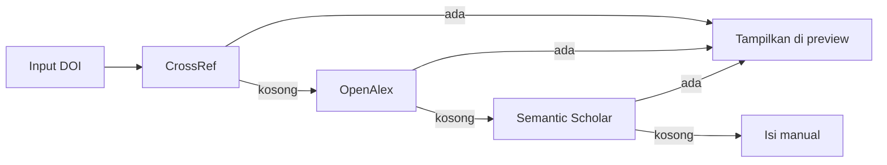

<div align="center">


<br />

<code>status: in-development</code> &nbsp;·&nbsp; <code>license: MIT</code> &nbsp;·&nbsp; <code>UNISMUH · Informatika</code>

<br /><br />

[](https://nestjs.com)
[](https://fastify.dev)
[](https://nextjs.org)
[](https://www.typescriptlang.org)
[](https://www.prisma.io)
[](https://www.postgresql.org)
[](https://redis.io)
[](https://docs.docker.com/compose/)

[](https://github.com/muhammadrizalharis/UNICAL-ASSOCIATES-REPO/commits/main)
[](https://github.com/muhammadrizalharis/UNICAL-ASSOCIATES-REPO)
[](https://github.com/muhammadrizalharis/UNICAL-ASSOCIATES-REPO/stargazers)

<br />

**[Tentang](#-tentang) · [Fitur](#-fitur-utama) · [Cara Kerja DOI](#-cara-kerja-upload-via-doi) · [Teknologi](#-teknologi) · [Menjalankan](#-menjalankan-secara-lokal) · [Status](#-status-pengembangan)**

</div>

---

## 🌟 Tentang

**UNICAL ASSOCIATES** adalah platform repositori publikasi ilmiah milik **Universitas Muhammadiyah Makassar**, terinspirasi dari ScienceDirect dan ResearchGate.

Platform ini menghimpun jurnal dan artikel yang **sudah terbit**, lalu menyusunnya dalam satu katalog yang mudah dicari, dilengkapi identitas peneliti permanen dan metrik riset otomatis.

> **UNICAL** = **UNI**smuh **C**atalog of **A**cademic **L**iterature · **ASSOCIATES** = jejaring peneliti yang berkontribusi di dalamnya.

UNICAL **tidak menerbitkan** jurnal. Yang disimpan hanya metadata beserta tautan DOI resmi, sebagaimana cara kerja Google Scholar dan Mendeley.

---

## ⚡ Cara Kerja Upload via DOI

<table>
<tr>
<td width="50%" valign="top">

### 😩 Cara Lama

```diff
- ketik judul artikel
- ketik nama penulis satu per satu
- cari volume, issue, halaman
- salin abstrak dari PDF
- hitung sitasi manual tiap semester
```

</td>
<td width="50%" valign="top">

### ⚡ Dengan UNICAL

```diff
+ tempel 10.1016/j.eswa.2024.123456
+ judul · penulis · jurnal · tahun
+ volume · issue · halaman · ISSN
+ abstrak (sumber berlapis)
+ sitasi diperbarui terjadwal
```

</td>
</tr>
</table>

Metadata diambil dari **CrossRef**, dan bila ada bagian yang kosong sistem otomatis melanjutkan ke sumber berikutnya:



> Rantai ini memang diperlukan: tidak semua penerbit menyetorkan abstrak ke CrossRef. Elsevier dan Springer Nature termasuk yang jarang melakukannya.

---

## 🚀 Fitur Utama

| | Fitur | Deskripsi |
|:--:|---|---|
| `🆔` | **UNICAL ID** | Identitas peneliti permanen, dapat ditautkan ke ORCID, Scopus, dan SINTA |
| `📥` | **Auto-fill DOI** | Tempel DOI, metadata terisi sendiri lengkap dengan daftar penulis |
| `📦` | **Bulk Import** | Unggah banyak DOI sekaligus lewat berkas CSV, TXT, atau BibTeX |
| `🔍` | **Pencarian Faceted** | Filter berdasarkan tahun, bidang ilmu, indeksasi, dan jenis publikasi |
| `🏷️` | **Badge Indeksasi** | Scopus Q1–Q4, SINTA S1–S6, DOAJ, dan Web of Science |
| `📊` | **Metrik Riset** | h-index, i10-index, total sitasi, serta grafik tren per tahun |
| `✋` | **Klaim Kepenulisan** | Peneliti dapat mengklaim artikel yang memuat namanya |
| `📎` | **Ekspor Sitasi** | BibTeX, RIS, APA, dan IEEE |
| `✅` | **Moderasi** | Publikasi diverifikasi sebelum tampil ke publik |
| `🔎` | **SEO & Scholar** | Meta tag Highwire Press agar terindeks Google Scholar |

---

## 🛠 Teknologi

<table>
<tr>
<td width="50%" valign="top">

### Backend
- **NestJS 11** dengan adapter **Fastify**
- **Prisma 7** + PostgreSQL 16
- **BullMQ** di atas Redis untuk antrean
- **Meilisearch** untuk pencarian
- **MinIO** (S3) untuk berkas

</td>
<td width="50%" valign="top">

### Frontend
- **Next.js 15** App Router
- **Tailwind CSS** + shadcn/ui
- **TanStack Query**
- SSR untuk SEO dan Google Scholar

</td>
</tr>
</table>

Seluruh komponen berjalan sebagai stack **Docker Compose** yang berdiri sendiri, tanpa berbagi layanan dengan aplikasi lain.

### Sumber Metadata

[CrossRef](https://api.crossref.org) · [OpenAlex](https://openalex.org) · [Semantic Scholar](https://www.semanticscholar.org) · [ORCID](https://orcid.org)

---

## 🐳 Menjalankan Secara Lokal

**Prasyarat:** Docker Engine 24+ dan Docker Compose v2.

```bash
git clone https://github.com/muhammadrizalharis/UNICAL-ASSOCIATES-REPO.git
cd UNICAL-ASSOCIATES-REPO

cp .env.example .env
make secrets          # salin hasilnya ke .env

make up               # bangun & jalankan seluruh stack
make health           # pastikan semua container sehat
```

Migrasi database:

```bash
docker compose exec api npx prisma migrate deploy
```

Perintah lain yang tersedia: `make logs`, `make psql`, `make backup`, `make restore`.

> Nilai port dan kredensial diatur lewat `.env`. Berkas tersebut tidak pernah ikut ter-commit.

---

## 🧪 Pengujian

```bash
docker compose exec api npm run test        # unit
docker compose exec api npm run test:e2e    # end-to-end
```

---

## 📈 Status Pengembangan

| Tahap | Cakupan | Status |
|---|---|:--:|
| Fondasi | Stack Docker, PostgreSQL, Redis, Meilisearch, MinIO | ✅ |
| Backend | NestJS + Fastify, skema Prisma, endpoint health | ✅ |
| Inti | Autentikasi, UNICAL ID, upload via DOI, moderasi | 🚧 |
| Sosial | Klaim kepenulisan, metrik, ekspor sitasi, koleksi | ⏳ |
| Skala | Pencarian lanjutan, ORCID, API publik, PWA | ⏳ |

---

## 🔒 Keamanan

Bila menemukan celah keamanan, mohon **jangan** membuka Issue publik. Laporkan lewat kanal privat kepada pemelihara repositori.

Ringkasan praktik yang diterapkan: kata sandi di-hash dengan Argon2id, autentikasi berbasis token, rate limit berlapis, RBAC pada seluruh endpoint sensitif, container berjalan sebagai pengguna non-root, dan layanan data tidak pernah diekspos ke internet.

---

## 🤝 Kontribusi

1. Fork repositori ini
2. Buat branch fitur: `git checkout -b feature/nama-fitur`
3. Commit dengan [Conventional Commits](https://www.conventionalcommits.org/): `feat:`, `fix:`, `docs:`
4. Ajukan Pull Request

---

## 📄 Lisensi

Dirilis di bawah **MIT License**.

---

## 📞 Kontak

| Peran | Nama |
|---|---|
| Owner & Pengembang | **Muhammad Rizal Haris** |
| Institusi | Universitas Muhammadiyah Makassar |

Pertanyaan dan saran silakan disampaikan lewat [Issues](https://github.com/muhammadrizalharis/UNICAL-ASSOCIATES-REPO/issues).

---

<div align="center">


<br />

**UNICAL ASSOCIATES** · dibangun untuk peneliti Indonesia 🇮🇩


</div>
